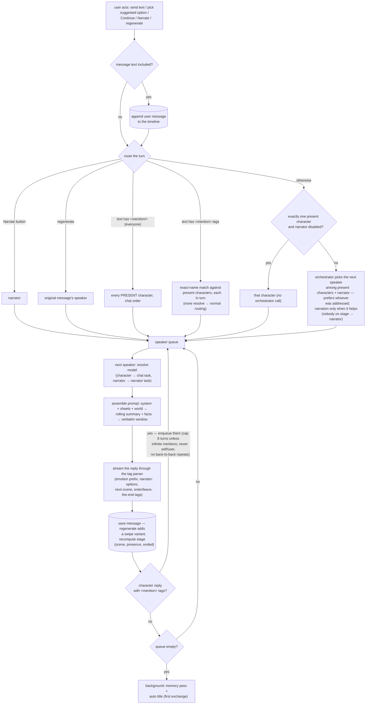

# AnimaChat — Specification

An AI-driven virtual character chat webapp with a visual-novel presentation. Personal, single-user, runs locally.

## Foundation

- **Stack:** Next.js (React + Node), SQLite (server-side, local).
- **Auth:** none — single user.
- **AI layer:** provider-agnostic. Built-in support for the Anthropic API and any OpenAI-compatible API.
- **UI language:** English. AI output language is configurable (see [Language](#language)).

## Providers & models

- Models are grouped under providers. The user adds providers, then adds models under each provider.
- **Provider:** display name, type (`anthropic` | `openai-compatible`), base URL, API key.
- **Model:** model ID, display name, **context window size** (tokens, user-entered — the hard ceiling), optional **pricing** (USD per million input / cache-read / cache-write / output tokens, user-entered — powers cost tracking; all empty = unpriced, an empty cache price = that leg billed as input, which suits providers that don't discount or surcharge it), optional **custom request body** (JSON) that is deep-merged into outgoing requests, user values winning over app defaults (e.g. `{"thinking":{"type":"disabled"}}`). Invalid JSON is flagged on save, not at chat time.
- API keys are managed in the in-app settings UI (stored in the database).
- **Per-task models:** a task→model map in settings — chat generation, narrator, group-chat orchestration, summarization & fact extraction, co-writing assistant, impersonate, title generation (future tasks slot in). Every task defaults to "inherit" the global default model.
- **Resolution order:** per-character model (group chats) → per-chat model → task's assigned model → global default.

## Entities

All world-building entities are reusable across chats. The library page has a per-type text search (name + description) and sorting (recently updated / newest / name).

**Image aspect ratios:** character sprites **2:3**, character avatars **1:1**, location/scene artwork **16:9**. Uploads are stored as-is; images at other ratios are displayed with cover-fit. The upload tile itself is clickable (click to upload/replace, hover reveals a remove button).

### Character
- Name, avatar (image upload, **1:1**, or auto-generated initials/color placeholder), **description** (personality, background, mannerisms, anything else), greeting, example dialogue.
- **Anti-recitation:** in prompts, the sheet is framed as private background knowledge — the character is instructed never to quote or re-announce their own traits/backstory, and not to reuse distinctive phrases from earlier messages. Example dialogue seeds the voice early in a chat only: once the character has enough of their own replies in the verbatim window (~8), it is dropped from the prompt and their real messages anchor the style.
- **Image prompt:** a stored text-to-image prompt describing the neutral sprite (co-writable by the AI assistant; for use with external image generators).
- Avatars are used in the message list / small character chips only — never on the VN stage. Library card covers prefer the neutral sprite (avatar, then placeholder, as fallbacks).
- **Expression sprite set** (**2:3** portrait):
  - ~12 predefined common expressions: `neutral, happy, sad, angry, surprised, embarrassed, thoughtful, fearful, disgusted, smug, excited, tired`. Shown as labeled upload slots; all optional, `neutral` is the expected fallback.
  - **Custom expressions:** name + short description (the description teaches the AI when to use it).
  - Characters with no sprites use `sprite-placeholder.svg` (a `currentColor` silhouette, theme-tinted).
- Optional per-character typing-sound override.
- **Preview:** a button on the library card opens a sprite preview (2:3 view with an expression switcher over the uploaded sprites; placeholder silhouette when none).

### Persona
- Multiple user personas (name + description); chosen per chat. Characters respond according to the active persona.
- **Create from character:** a button on a character's library card copies its name + description into a new persona (a snapshot — later character edits don't propagate; self-referential `[char_name]` tags are converted to `[user_name]`).

### Location
- Reusable place description.
- Optional **artwork** (chat background, **16:9**), optional **BGM**, optional **ambient SFX loop** (rain, tavern chatter…) mixed under the BGM.
- Optional **chat style** — a palette of Bg/Fg surface pairs applied while the place is active: `stageBg` (VN backdrop), `panelBg`+`panelFg` (the chat panel & its controls — badges, borders, inputs derive from this pair), `messageBg`+`messageFg` (message bubbles), `accent`+`accentFg` (buttons & highlights). Every omitted Fg auto-contrasts with its Bg. Styles are colors only — surface opacity is a system setting, never part of a style. Has its own **enable checkbox, off by default** — colors apply only when explicitly enabled; a non-enabled location style contributes nothing (falling back to the scene's, per precedence). Governed overall by the global "scene & location styling" switch.
- **Image prompt:** stored text-to-image prompt for the background artwork (co-writable by the AI assistant).

### Scene
- A situation/setup; optionally references a location.
- Optional **artwork** (**16:9**), optional **BGM**, optional **ambient SFX loop**, optional **chat style** (same fields as a location's).
- **Image prompt:** stored text-to-image prompt for the background artwork (co-writable by the AI assistant).
- **Precedence:** if a scene references a location, the location's artwork/BGM is used; otherwise the scene's own. If the referenced location lacks an asset, fall back to the scene's own (location wins when present — the slot isn't forced). Chat style resolves the same way, per field.

### Story
- A full storyline: description (premise & arc), an ordered **cast** (characters), an ordered sequence of **scenes**, and optional **lorebooks**.
- **Per-scene cast:** each scene entry lists which cast members are on stage when the scene opens (a subset of the roster). This staging lives on the story→scene relation, not on the reusable scene entity — the same scene can appear in different stories with different casts.
- Cast order drives `[charN_name]` in playthroughs; the "play as" picker offers the cast.

### Library integrity (deletion protection)

Items referenced by authored structures cannot be deleted; the API refuses (409) and the UI explains what still uses them, by name. The chain: **location ← scene** and **character/scene/location/lorebook ← story**. Stories themselves are always deletable — playthroughs are self-contained snapshots (see Chat) and never block or break. Casual/immersive chat references don't block either: those chats degrade fail-soft (a deleted character's messages keep a snapshotted display name).

### Lorebook (world info)
- Reusable, keyword-triggered knowledge entries (people, factions, history, rules of the world).
- Each entry: title, trigger keywords, content, and scan settings (e.g. how much recent context to scan).
- When a trigger keyword appears in recent chat context, the entry's content is injected into the prompt.
- Lorebooks are reusable entities; a chat (or a story/scene/character) can attach one or more.

### Chat
- **Chat modes** (chosen at creation, fixed afterwards):
  - **Casual** — no setting. Pick a persona, one or more characters (in speaking order), optional lorebooks, optional narrator. Characters may be omitted when the narrator is enabled — a narrator-only solo chat plays like a text adventure.
  - **Immersive** — one fixed **scene or location** (a single "Setting" picker lists both; the picked entity's type is stored). Plus persona, one or more characters, optional lorebooks, optional narrator. Never switches.
  - **Story (a "Playthrough")** — pick a story; its cast, scenes and lorebooks come with it. **Play as** a cast member or an existing persona (or spectate). The **narrator is required** and directs everything; optionally pick a starting scene (defaults to the first). Characters and lorebooks are not picked — they're the story's.
- **Playthroughs are self-contained:** creation takes a **snapshot** of the whole story bundle (story sheet, cast character sheets, scene entries with per-scene casts, referenced locations, lorebooks — text embedded, media as content-addressed asset ids). The playthrough never reads the library afterwards: deleting or editing library items (or the story itself) can't touch a running or finished playthrough. Library edits reach new playthroughs only.
- **Play as a cast member:** the chosen character's snapshot sheet doubles as the persona; the remaining cast are the AI participants. Their affinity with the played character is tracked as character↔character relationship data.
- All settings are **fixed at creation** — participants, persona, setting/story, lorebooks, narrator, language, POV. The single exception is the **model** (and title/folder/tags/chat layout/advanced overrides): cost/presentation knobs, not fiction state, so they stay editable.
- **Greeting** exists in exactly one shape: a casual chat with exactly one character and the narrator disabled may open with that character's greeting message (**opt-in, default off**). Everywhere else the opening move belongs to the narrator or the user.
- **The narrator, when enabled, always speaks first:** an empty chat immediately triggers a narrator turn (scene-setting + suggested actions).

### Placeholder tags

Sheets (character/persona/location/scene/story/lorebook text fields) may contain placeholder tags, replaced with actual chat values at injection time (prompt assembly and greeting insertion):

- `[char_name]` — inside a character's own sheet fields (description, greeting, example dialogue, custom expression descriptions): that character's name; elsewhere: the chat's first character. `[charN_name]` — Nth character (1-based, chat order; in a playthrough that's the story's cast order minus the played character); `[char1_name]` is always positional.
- `[user_name]` / `[persona_name]` — active persona's name
- `[loc_name]`, `[scene_name]`, `[story_name]` — active location/scene/story names
- Case-insensitive. Unresolvable tags get a neutral fallback ("another character", "the current place", …) so the AI never sees broken brackets. Unknown bracketed text is left as-is.

## Chat experience

- **Streaming** responses (token-by-token), revealed at the configured typing speed (see [Typewriter reveal](#visual-novel-presentation)).
- **Editing:** any message (user's or a character's) is editable **in place** — no branch created.
- **Regenerate:** creates **swipeable alternatives**; the selected one continues the conversation.
- **Long-term memory:** rolling conversation summaries + extracted-facts store per character, persisting across sessions.
  - **Structure:** a "verbatim window" of recent messages is always sent raw (default ~35% of the chat's context budget); older history is covered by the rolling summary. Prompt order: system/character/scene → rolling summary + facts → verbatim window.
  - **Trigger:** after each assistant response, a background check measures un-summarized history that has scrolled out of the verbatim window; past the chunk threshold a background job summarizes the chunk and merges it into the rolling summary (compacting the summary itself when it grows too large). Fact extraction runs on the same chunk in the same pass.
  - **Tunables** — in an "Advanced: memory & context" settings panel, global defaults with per-chat overrides; sensible defaults so none of it is mandatory:
    - **Context budget:** max tokens of assembled prompt per request. Default: min(cap e.g. 32k, model context window − output reserve). Separate from the model's window as a cost control.
    - **Verbatim window share:** % of the context budget kept as raw messages (default ~35%).
    - **Chunk threshold:** out-of-window tokens accumulated before a summarization pass (default ~3k).
    - Token counts are local estimates (providers tokenize differently); the output reserve absorbs the error.
  - **Safety valve:** if prompt assembly finds history that genuinely won't fit (huge paste, smaller-context model) before background jobs catch up, it summarizes synchronously that once.
  - **Invalidation:** in-place edits or save-state rewinds touching summarized ranges invalidate the affected coverage and queue re-summarization. Swipes alone trigger nothing.
  - Summarization/extraction calls are tagged `memory` in token tracking.
- **Group chats:** multiple characters; **auto-orchestrated turn-taking** (an LLM picks the next speaker). In a playthrough, all speaker routing operates on the characters **currently on stage** (see Stage presence under Narrator) — off-stage cast can't speak or be @mentioned, only narrated in. The user can address characters directly with **mentions**: typing `@` in the input pops a messenger-style picker over the present characters (plus `all`); the sent message stores them as `<mention>Name</mention>` (`<mention/>` = everyone), rendered as highlighted chips. Hand-typed exact `@Name`/`@all` converts the same way on send (server-side, against the on-stage cast); anything else stays plain text. Mention routing is deterministic — exact name match against present characters, no orchestrator call; several mentions make each addressed character reply in turn, and the everyone-mention makes every present character reply; a message whose mentions all fail to resolve routes normally. The user's mention tags are flattened back to plain `@Name` for prompts, summaries and exports; in the input they render as chips too (a styled mirror behind the textarea) and delete atomically — Backspace/Delete touching a chip removes the whole mention, not one character. **Characters use the same tags:** they're instructed to hand the turn with `<mention>Their Name</mention>` (exact names — a plain name doesn't pass the turn); their tags resolve the same deterministic way (self/user mentions ignored) and stay in their message text — visible in prompt history as live examples of the convention, rendered as chips, flattened only in summaries and exports: a character reply that @mentions another character (they're told they may) hands them the next turn — mentions of the author themselves or of the user's persona are ignored, back-to-back repeats are skipped, and a hard cap on AI turns per request keeps chains finite. A per-chat **infinite mentions** toggle (chat settings, off by default) lifts the cap; switching it off mid-chain doesn't interrupt the reply being written, but stops the chain after it finishes.
- **Save states & rewind:** bookmark a moment in a chat (VN-style checkpoint); later "load" it, either truncating the chat back to that point or forking a copy from it.
- **Impersonate:** a button that has the AI draft the *user's* next reply in the active persona's voice, **streamed into the input box**; editable before sending. While it writes, the input is locked and the button becomes a **Stop** — stopping keeps the partial draft (a half-written line is still a starting point). When the draft lands the box is focused with the caret after it, ready to keep writing.
- **Relationship/affinity tracking:** per character–persona pair, the AI maintains an evolving relationship state (affinity, trust, notes) that persists across chats and feeds prompts. When the user plays a story cast member, that pair is tracked as a character↔character relationship instead. Facts/relationships live in the library, so a playthrough whose snapshot characters were deleted from the library simply skips those updates. **Character↔character relationships too:** each character keeps their own directed view (affinity, note) of other characters, updated by the same memory pass and injected into that character's prompt for characters present in the chat. Both kinds are governed by **system settings** (default on; off = no updates, no prompt injection): "user relationships" for persona↔character, "character relationships" for character↔character. Inspectable in the chat settings drawer and in the character editor. Can be **disabled per character** (toggle: no updates, no prompt injection, applies to both kinds) and **reset** (deletes that character's relationship data with all personas and characters).
- **Organization:** chat tags/folders, auto-generated chat titles, full-text search across all chats. Playthroughs are labeled "Playthrough — <story name>" (from the snapshot, so the label outlives the story) with a "The End" badge once completed.
- Markdown rendering with styled action text.

### Turn & message workflow

One generation request handles a whole turn: the user's message (if any) is saved to the timeline **before** any AI call, then speaker routing decides who replies — the narrator is just one candidate in the orchestrator's vote, never a middleman. A turn can produce several replies (multiple @mentions, `@all`, or characters chaining mentions).

Notes: each queued turn rebuilds the context, so later speakers see earlier replies (and live settings changes like the infinite-mentions toggle); the orchestrator runs on the `orchestrator` task model, while mention routing is pure name matching — no model call; a Stop press ends the chain after the current reply is saved. "Present" = the on-stage cast in a playthrough; in casual/immersive chats every participant is always present.

### Message format (speech & actions)

Shared convention for AI and user:
- `*actions*` in asterisks → rendered italic, muted (stage-direction style). In chat messages single-asterisk means action, not emphasis.
- `"dialogue"` in quotes → normal, prominent text.
- Plain user text is treated as dialogue; input helpers (shortcut/toolbar) wrap selection in asterisks.
- Stored as plain text with the convention embedded; edits work on the raw text.

### Point of view

Configurable: global default + per-chat override. Conventions:
1. **User 1st person, characters 3rd** — user writes "I…", characters write about themselves by name.
2. **All 3rd person** — co-written novel style.
3. **2nd-person VN** — narrator/characters address the user as "you"; user writes 1st person.

Character and narrator prompts adapt; narrator's suggested actions are written in the user's POV so they can be sent as-is. A chat's POV is chosen at creation and cannot change afterwards.

## Narrator

Optional in casual and immersive chats; **required in playthroughs**, where it is the stage director. When enabled, it always **speaks first** in a new chat.

- **Triggers:** auto — narrates when it would help (scene-setting, transitions, plot advancement); also summonable on demand via a button (the user's only pacing lever in a playthrough — there is no manual scene control).
- **Suggested actions:** after narrating, offers 2–4 in-character choices rendered as buttons; clicking sends as the user's message (pre-formatted in the chat's convention/POV). Free-text input always remains available. Suppressed on a concluding message and after the story has ended.
- **Scene progression (playthroughs):** the narrator alone advances the story to the next scene via `<next-scene/>`. There is no manual switching in any mode.
- **Stage presence (playthroughs):** a scene opens with its per-scene cast on stage; mid-scene the narrator may bring roster members on with `<enter>Name</enter>` or send them off with `<leave>Name</leave>` (describing it in the narration too). Only present characters speak, are drawn on stage, get prompt sheets, or can be @mentioned; the narrator sees the full roster (on/off stage) so it can stage entrances — including reacting to the user wishing someone were there. The played character is exempt (the user always speaks).
- **The ending (playthroughs):** when the story reaches its resolution — typically in the final scene, where `<next-scene/>` is unavailable — the narrator concludes it with `<the-end/>`. The playthrough shows a completed "The End" state (badge in the chat list, header, timeline) and the prompt context flips to a free-form **epilogue**: the chat is not locked, characters and narrator still respond knowing the story is over, but no more scene advances, staging, or suggested actions. There is no manual "end story" button; the user can always ask the narrator in-fiction to wrap up.
- **All stage state derives from the timeline:** scene changes, enter/leave, and the ending are events stored as metadata on narrator messages, folded over visible history (`computeStage`). Rewinds, save-state loads, and forks therefore restore the scene, its background/BGM, who was on stage, and the un-ended state automatically; there is no free-floating stage field to go stale. Forking from before the finale yields an alternate-ending playthrough for free.

## Visual-novel presentation

- **Layout:** chat pages hide the app chrome entirely — the view is a full-bleed VN stage (sprites centered) with a floating back button (+ "The End" badge) at the top-left corner, followed in the same row by the active **scene/location names** as a chip (VN-style location card; fades in on change). Each chat has a **chat layout**, chosen at creation and switchable anytime (chat settings drawer, or the corner button) — presentation only, never fiction state:
  - **Side panel** (default) — the chat log **floats over the stage on the right** as a translucent, headerless sidebar (a little top padding where the header used to be); its backdrop blur (default on) and its background opacity (default 30%, shared with the VN dialogue box) are global settings. On narrow screens the panel spans the full width. The log **opens on the newest message** (landing there directly, not scrolling down to it) and follows the tail as replies stream — but only while the reader is at the bottom: scrolling back to re-read holds the view still (even mid-reply) and floats a **jump-to-latest** button, which returns to the newest message and re-pins the tail.
  - **Dialogue box** — a VN dialogue box + input box centered at the bottom of the stage (see below).
- **Corner controls:** four floating buttons at the stage's bottom-left corner — a **layout switch** (persisted; a shortcut for the chat-layout setting in the settings drawer, which opens from the **left**), **chat settings**, **picture mode** (a non-persisted toggle that hides the chat UI — panel/dialogue box and the scene/location chip — to enjoy the unobstructed stage; generation keeps streaming while hidden, and the button hints at ongoing activity), and **mute**: silences both audio channels at once (persisted).
  The buttons idle at low opacity and come up to full under the cursor. **In picture mode the corner group and the floating back button fade out entirely**, reappearing only on hover — nothing sits on the stage but the art. They stay clickable while invisible, exactly where they were, and **Esc leaves picture mode** (the way out that needs no aiming). An open drawer/dialog always gets Esc first.
- **Scene/location styling:** when the global "scene & location styling" switch is on (default on), the active scene/location's chat style colors the view. Location fields win over scene fields, per field. Off = the app's default look everywhere. The palette follows one rule — **each text color belongs to exactly one background family**, and every family's text auto-contrasts when not explicitly set:

| Family | Backgrounds | Text |
|---|---|---|
| Stage | `stageBg` — replaces the default gradient when there's no artwork, underlays it while loading (both chat layouts) | — (no text sits on the stage) |
| Panel | the panel itself (`panelBg` @ the global chat-panel-opacity setting); derived shades: inputs & secondary buttons (92%), hover (82%), badges/avatar chips/borders (68%); narrator & user bubbles are translucent and sit on the panel | `panelFg` (auto-contrast with `panelBg` when unset); muted steps at 85/65/45% alpha for names, badge labels, hints |
| Bubbles | character bubbles: `messageBg`, solid; the VN dialogue box (dialogue-box layout): `messageBg` @ the global chat-panel-opacity setting | `messageFg` (auto-contrast with `messageBg` when unset); `*actions*` at 70% alpha |
| Accent | primary buttons, slider thumb, focus rings — `accent` plus derived hover/active shades | `accentFg` (auto-contrast with the accent when unset) |

  Error surfaces (alerts, the Stop button) always keep theme colors so failure states stay recognizable. The accent also appears as decorative text (avatar initials, the streaming caret, VN speaker names) on panel/bubble surfaces — where the style makes the accent unreadable there (WCAG contrast < 3), it automatically falls back to that family's own text color.
- **Stage:** the speaking character's sprite displayed large. With multiple characters, all **present** participants' sprites are on stage (in a playthrough that's the on-stage cast; elsewhere everyone); the current speaker is at full brightness, others dimmed.
- **Expression selection:** each character message carries an emotion tag chosen by the AI (see AI output structure). Resolution: exact match → `neutral` → placeholder sprite (avatars are never shown on stage). Tags are stored per message, so scrolling history and swiping alternatives replay expressions. The tag is user-correctable when editing a message.
- **Background:** active scene/location artwork (precedence rules above).
- **BGM:** active scene/location BGM (same precedence); loops, cross-fades on scene/location change.
- **Audio channels:** two independent levels — **music** (the BGM) and **sound effects** (ambient loops + typing blips) — plus one **master mute** covering both. Sliders in the chat settings drawer, mute also on the stage's corner buttons. All three are global settings (they persist across chats and reloads); each channel has its own fixed trim so the two sit at comparable loudness at the same slider value.
- **Typewriter reveal:** a reply types out character by character instead of appearing in the bursts the provider streams it in. Speed is a global **typing speed** setting (characters per second, default 60; **0 = off**, text appears as it arrives). The reveal is decoupled from arrival — it drains a buffer of received text, and its rate scales with the backlog, so it trails a fast model by a few seconds rather than falling ever further behind. Pressing **Stop** reveals the rest at once, and in a multi-speaker turn each reply finishes typing before the next one starts. In the dialogue-box layout the reveal is paged and reader-driven — see [Dialogue-box layout](#visual-novel-presentation).
- **Typing SFX:** `sfx-typewriter.wav` plays as the text reveals (VN-style blip, following the typewriter rather than the network); global toggle, per-character override.
- **Sprite animation:** fade/slide transitions on expression change and character enter/leave; subtle idle motion (e.g. breathing bob) so the stage feels alive — the idle motion can be disabled per character.
- **Dialogue-box layout** (the former fullscreen VN mode, now a first-class chat layout): just background, stage, and a dialogue box at the bottom, advancing on click like a real visual novel; on the latest message the input box sits under it. The stage always fills the viewport; the dialogue box floats over it, height-capped to roughly the bottom third. A multi-paragraph message advances **paragraph by paragraph** (display-only pagination — the stored message stays whole; a bouncing chevron marks more pages, and suggested actions/input appear only on the last page). **The user's own line takes the box first:** sending (or picking a suggested action) shows it immediately under the persona's name, held until the reply actually appears on screen and for a minimum beat (~0.7s) so a fast model can't flash it past — the stage stays quiet meanwhile, since nobody is speaking yet. A streaming reply **types into the page it belongs to and stops there**: the reveal parks at the end of the page (bouncing chevron) and waits — the typewriter never turns the page itself, the reader always does. Advancing mid-reveal first **completes the page being typed** (VN skip); advancing again turns to the next one, which types out from its start. The reply therefore lands already on its final page: nothing is re-read and nothing reflows. (Picture mode has no dialogue box to click, so the reveal runs straight through while hidden.) **Backlog navigation:** wheel-up on the stage, ←, or Backspace step backward (previous page, then the last page of the previous message); wheel-down, →, Space, Enter, or click step forward. **Esc** leaves the backlog in one press, landing on the last page of the latest message (only while browsing — at the live end Esc stays free for drawers and dialogs). Wheel over the dialogue box scrolls its own overflowing content instead. **The stage replays with the backlog:** stepping back restores each character's expression as of the message on screen and highlights whoever is speaking in it (nobody, on a user or narrator line) — the scene, background and BGM stay live (browsing rewinds the performance, not the fiction). A new reply jumps back to the live end.
- Character-immersive theming throughout.

## AI output structure

Chat content is prose; structure rides in small markers parsed out of the stream and stored as message metadata:

- **Character responses:** small prefix marker (e.g. `<emo>smug</emo>`) then pure prose. Parser consumes the marker early in the stream (sprite switches as the character "starts talking"), strips it, streams the rest. Missing/malformed marker → fall back to `neutral`, show full text.
- **Narrator turns:** narration prose + trailing `<options>…</options>` block (held back, rendered as buttons) + optional staging tags (scene advance, enter/leave, the end).
- **Non-conversational calls** (speaker selection, memory extraction, co-writing form edits): proper structured output (tool calls / JSON schema).
- **Emotion tagging is decoupled from sprite availability:** the prompt always offers the full standard emotion vocabulary plus the character's custom expressions (with descriptions), and states that the tag is descriptive metadata — not a constraint on the writing. Messages store the character's true emotion even when no matching sprite exists; sprite resolution happens at display time (tag → `neutral` → placeholder), so later-uploaded sprites apply retroactively to old messages.

### Structured tags reference

All inline tags that may appear in AI chat output. The stream parser strips them from displayed text and stores their payload as message metadata. Anything not in this list is treated as plain text.

| Tag | Emitted by | Position | Purpose |
|---|---|---|---|
| `<emo>name</emo>` | Characters | Prefix (first tokens) | Emotion tag for the message; drives sprite expression. One per message. |
| `<options><o>text</o>…</options>` | Narrator | Trailing (end of message) | 2–4 suggested user actions, each in an `<o>` element, pre-written in the chat's POV/convention. Held back from display, rendered as buttons. |
| `<next-scene/>` | Narrator | Trailing | Advance the story to the next scene. Recorded as a stage event on the narrator message. |
| `<enter>Name</enter>` | Narrator | Inline | Bring a roster member on stage mid-scene. Name resolved fail-soft against the cast; recorded as a stage event. |
| `<leave>Name</leave>` | Narrator | Inline | Send a present character off stage. Same resolution and storage as `<enter>`. |
| `<the-end/>` | Narrator | Trailing | Conclude the playthrough. Recorded as a stage event; suppresses that message's options. |

Parser rules:
- Tags are parsed from the stream incrementally: prefix tags are consumed before display begins; trailing tags are held back once an opening `<options>`/`<next-scene`/`<the-end` is detected at the tail.
- **Malformed or unknown tags:** fail soft. A broken `<emo>` → message falls back to `neutral` and full text is shown; a broken `<options>` block → its raw text is dropped or shown as prose; an `<enter>`/`<leave>` name matching nobody is ignored; never an error state.
- **One emotion per message: the first `<emo>` wins.** Models sometimes drop a stray second tag mid-message; it is stripped from the text and ignored everywhere (stored message and live stage alike), so the sprite never swaps mid-message and snaps back.
- Staging tags (`<next-scene/>`, `<enter>`, `<leave>`, `<the-end/>`) only take effect on narrator messages in a playthrough, and never after the story has ended.
- Tag names are English regardless of the chat language; only the payload (option text) follows the language setting.
- Stored metadata (emotion, options, stage events) is user-editable via message editing.
- Future tags must be added to this list and follow the same prefix/trailing + fail-soft rules.
- `<mention>Name</mention>` / `<mention/>` is deliberately NOT in this table: it is message-text syntax (user- and character-written) that stays in the stored content — rendered as a chip, parsed for turn routing, never stripped by the stream parser (a half-arrived tag is only hidden from the typewriter until it completes).

## AI assist (co-writing)

- Chat-style co-writing side panel in every editor (character/story/scene/location).
- Conversational side streams as prose; the assistant fills/updates form fields via tool calls as the discussion progresses. While the (held-back) field data is being written, the panel shows a pulsing "writing into the form…" indicator so the pause doesn't read as a stall.
- **Rewind:** every user message in the panel has a rewind button — it rolls the conversation *and* the draft form/items back to the state before that message was sent, putting the message text back in the input for a redo. Session drafts only; nothing touches saved records until Save.
- **Reference attachments:** a picker in the input toolbar attaches library items (characters, personas, locations, scenes, stories, lorebooks) to the conversation — a search-as-you-type multi-combobox over the whole library (capped result list; nothing enumerates every item), shared with the export dialog; their sheets are sent as read-only background context with every message, so new content can build on the existing cast and world (e.g. a scene written for specific characters). Items that no longer exist are skipped silently.
- **Image prompts** the assistant writes are strictly visual (what a camera sees — no names, personality, backstory or lore) and always in English regardless of the language setting, unless explicitly asked otherwise; they never mention aspect ratio. Character sprite prompts cover physical appearance, outfit, pose and framing/view distance, ending on a solid flat single-color background — never environment or scenery.
- **Library guide:** a Guide button on the library page opens a batch co-writing dialog — the assistant creates/updates any number of items across all types in one conversation, shown on the left as editable forms (removable per item). Attached `.txt`/`.md` files are sent as source material (truncated past a size cap) so items can be extracted from a novel or notes. Nothing persists until Save, which stores the whole batch in dependency order — scenes link to locations, and stories to their cast, scene sequence (with per-scene casts) and lorebooks, all by name, against the batch or the existing library. The story editor's own assist panel writes the same name-based links, resolved into the form as the assistant fills it.
- Follows the global language setting.

## Language

- Global default + per-chat override for the language the AI writes in (characters, narrator, suggested actions).
- Also applies to the AI co-writing assistant.
- App UI itself stays English.

## Token usage tracking

- Every AI call records input/output tokens, tagged with provider, model, and feature (chat, narrator, orchestrator, memory, co-writing assistant, future features).
- **Cache reads and writes are logged separately** from full-price input: OpenAI-compatible providers cache automatically and report the discounted read portion (`cached_tokens` / DeepSeek's `prompt_cache_hit_tokens`) and — on models that surcharge writes, e.g. GPT-5.6+ — the written portion (`cache_write_tokens`); both are subsets of `prompt_tokens` and are split out of it. Models that don't report writes simply bill them as input, which matches their pricing. This matters here because every turn resends a long history prefix. The Anthropic client doesn't request caching, but reads (`cache_read_input_tokens`) and writes (`cache_creation_input_tokens`) are captured if a response ever reports them.
- Usage dashboard in settings: breakdowns by provider/model/feature and totals over time (cache-read share shown in the totals).
- **Cost tracking:** derived from the per-model prices (USD per million tokens) at report time — never stored per call. Prices therefore apply retroactively to the whole logged history, and editing a price recomputes it. Cache reads/writes bill at their own price, each falling back to the full input price when unset. Tokens from models with no prices set (or logged under a provider/model that no longer exists) are reported as **unpriced**, never as $0; cost figures are estimates (token counts fall back to local estimation when a provider omits usage).

## Import / export

- Character, location, scene, story, and lorebook can be exported; multiple items can be combined into a single **bundle**.
- Bundle = zip with a JSON manifest + all referenced assets (avatars, sprites, artwork, BGM).
- A story export pulls in its cast, scenes (with per-scene casts), the scenes' locations, and its lorebooks.
- Import opens a **selection dialog** listing the bundle's contents (everything checked by default): checking an item auto-checks and locks its in-bundle dependencies (story → cast/scenes/lorebooks, scene → location); the server enforces the same dependency closure. Duplicate handling as before (references remapped, names deduped); only assets the imported items reference are written.
- **Chat archive:** a chat can be exported as a self-contained zip (chat settings drawer) — messages with all swipe variants and stage events, save states, and (for playthroughs) the snapshot's assets; character display names are completed into the snapshot so the archive reads correctly without the library. Import from the chat-list page creates a **new** chat (fresh ids, checkpoints remapped); the rolling summary is not carried — memory re-summarizes on the next turn. Library references degrade fail-soft as usual.
- **Novel export:** export a chat as clean formatted prose (markdown / EPUB), narrator text included, reading like a book chapter — scene advances become chapter headings, `<the-end/>` a closing "The End".
- **Full backup/restore:** one-click export of the entire database + all assets as a single archive (distinct from entity bundles); restore from archive.
- **Storage panel:** a settings group shows the uploads folder's file count & total size, with a prune button that deletes files nothing references (after a confirm showing count & size; unsaved editor uploads count as unused). References counted: characters, locations, scenes — **and playthrough snapshots**, so a finished playthrough keeps its sprites/art/BGM alive even after the library items are deleted.

## Assets in repo

- `sprite-placeholder.svg` — default character sprite (currentColor silhouette).
- `sfx-typewriter.wav` — default typing SFX (16-bit mono PCM, 44.1 kHz).
