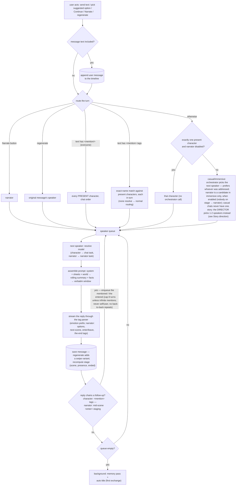
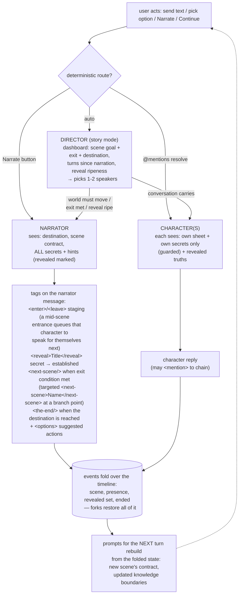

# AnimaChat — Specification

An AI-driven virtual character chat webapp with a visual-novel presentation. Born personal, single-user and local; **gradually migrating to a multi-user online platform** — new features must prefer multi-user-ready patterns (paginated collections, transactional reference tracking, stateless app servers) over single-user shortcuts.

## Foundation

- **Stack:** Next.js (React + Node), TanStack Query on the client, PostgreSQL for data, S3-compatible object storage (MinIO) for uploaded assets. The database schema lives in SQL migration files applied out-of-band (fresh installs automatically via the Postgres image's init hook; existing databases manually) — the app itself runs no DDL. Collection APIs are standard paginated CRUD: `{ items, nextCursor }` envelopes (keyset cursors), server-side search/sort/filter, consumed as infinite queries.
- **Asset storage:** uploads are content-addressed (the asset id is derived from the file's SHA-256) and go **from the browser straight to the bucket** via presigned PUT URLs — the app server never carries the bytes. The storage layer enforces the hash (a signed checksum header), so an object can never sit under the wrong id; re-uploading a known file skips the transfer entirely (dedup). Serving stays behind the app (`/api/assets/<id>`). Which items reference which assets is materialized in a dedicated reference table (`asset_refs`), rewritten in the same transaction as every save/delete of an owning item — the basis for pruning today and for per-user quotas and event-driven reclamation later.
- **Auth:** none yet — single user today. Accounts, per-user data scoping and quotas arrive with the multi-user migration; until then, nothing may *depend* on the app staying single-user.
- **AI layer:** provider-agnostic. Built-in support for the Anthropic API and any OpenAI-compatible API.
- **UI language:** English. AI output language is configurable (see [Language](#language)).

## Providers & models

- Models are grouped under providers. The user adds providers, then adds models under each provider.
- **Provider:** display name, type (`anthropic` | `openai-compatible`), base URL, API key.
- **Model:** model ID, display name, **context window size** (tokens, user-entered — the hard ceiling), optional **pricing** (USD per million input / cache-read / cache-write / output tokens, user-entered — powers cost tracking; all empty = unpriced, an empty cache price = that leg billed as input, which suits providers that don't discount or surcharge it), optional **custom request body** (JSON) that is deep-merged into outgoing requests, user values winning over app defaults (e.g. `{"thinking":{"type":"disabled"}}`). Invalid JSON is flagged on save, not at chat time.
- API keys are managed in the in-app settings UI (stored in the database).
- **Per-task models:** a task→model map in settings — chat generation, narrator, group-chat orchestration, story direction (the playthrough director), summarization & fact extraction, off-screen life (chat returns), co-writing assistant, impersonate, title generation, novel rewrite (future tasks slot in). Every task defaults to "inherit" the global default model.
- **Resolution order:** per-character model (group chats) → per-chat model → task's assigned model → global default.

## Entities

Library entities (characters, personas, locations, scenes, lorebooks) are reusable across chats. The library page lists each type as a paginated grid (infinite scroll) with server-side text search (name + tags), tag filter, and sorting (recently updated / newest / name). **Stories are not library items**: a story owns embedded copies of its characters/scenes/locations/lorebooks and lives in its own top-level **Stories** section (see Story below) — the app's main navigation is Chats / Stories / Library / Settings.

**Tags:** every library item and every story carries optional free-form tags for grouping and filtering — edited as a comma-separated field in each editor, shown as chips on cards, and filterable via a tag dropdown (per type; the library filter resets when switching type tabs). Tags travel with exported bundles. Purely organizational — never injected into prompts.

**Image aspect ratios:** character sprites **2:3**, character avatars **1:1**, location/scene artwork **16:9**. Uploads are stored as-is; images at other ratios are displayed with cover-fit. The upload tile itself is clickable (click to upload/replace, hover reveals a remove button).

### Character
- Name, avatar (image upload, **1:1**, or auto-generated initials/color placeholder), **description** (personality, background, mannerisms, anything else), greeting, example dialogue.
- **Example dialogue is the character's own voice only:** a few short lines, one utterance per line in the actions/dialogue convention — never a labeled multi-speaker transcript (no `Name: …` turn labels, no other speakers' lines). It seeds *how this character speaks*; the co-writers are instructed to write it this way.
- **Reply scope:** in prompts, a character writes only their own words, actions and perceptions in the current moment — never the user's actions, dialogue, decisions, or what happens to them. When a narrator is enabled, plot developments and outside events are left to it; either way replies end where the user can react (keeps characters from drifting into narrator-style event direction, most tempting in 2nd-person VN POV).
- **Anti-recitation:** in prompts, the sheet is framed as private background knowledge — the character is instructed never to quote or re-announce their own traits/backstory, and not to reuse distinctive phrases from earlier messages. Example dialogue seeds the voice early in a chat only: once the character has enough of their own replies in the verbatim window (~8), it is dropped from the prompt and their real messages anchor the style.
- **Image prompt:** a stored text-to-image prompt describing the neutral sprite (co-writable by the AI assistant; for use with external image generators).
- Avatars are used in the message list / small character chips only — never on the VN stage. Library card covers prefer the neutral sprite (avatar, then placeholder, as fallbacks).
- **Expression sprite set** (**2:3** portrait):
  - ~12 predefined common expressions: `neutral, happy, sad, angry, surprised, embarrassed, thoughtful, fearful, disgusted, smug, excited, tired`. Shown as labeled upload slots; all optional, `neutral` is the expected fallback.
  - **Custom expressions:** name + short description (the description teaches the AI when to use it).
  - **Expression SFX:** every expression (standard or custom) can carry an optional one-shot sound (laughter, sigh…), played on the VN stage when the character's displayed expression *changes* to it — never when the emotion stays the same between messages, and never on opening a chat. Plays on the sound-effects channel; independent of whether a sprite is uploaded for that expression, and replayed when backlog browsing or swipes change the displayed expression.
  - Characters with no sprites use `sprite-placeholder.svg` (a `currentColor` silhouette, theme-tinted).
- Optional per-character typing-sound override.
- **Aliveness traits** — how much of a life of their own the character has, per character (casual & immersive chats only: in playthroughs pacing belongs to the story's director and narrator, and real time isn't story time). **All off by default** — a plain character is purely reactive; each trait is opted into independently in the character editor. Stored sparse, so pre-feature characters are simply all-off:
  - **Initiative** — the prompt grants the character their own moods, opinions, wants and topics: callbacks to remembered facts, disagreeing, wanting things, drifting the subject; discourages the formulaic reply shape (action + response + question back).
  - **Time awareness** — real elapsed time reaches the prompt: a note when the conversation resumes across a gap (≥ 3 h of wall-clock time), and remembered facts dated ("3 days ago, in another conversation"). Wall-clock by design — leave it off for characters living in period or fantasy settings where real time isn't fiction time. Casual chats and setting-less immersive chats only: a fixed scene or location pins the fiction to its own moment, so real elapsed time stays out of it regardless of the trait.
  - **State of mind** — the memory pass maintains an evolving inner state (current mood, wants, unresolved threads, 1–3 lines), injected into the character's prompt as private color. Kept per character × chat, so a mood never leaks between unrelated fictions; replaced on every memory pass.
  - **Off-screen life** — `off` / `background` / `texts first`; what happens when the user returns to a casual or setting-less immersive chat after a real gap — see *Returning to a chat* under Chat experience.
- **Preview:** a button on the library card opens a sprite preview (2:3 view with an expression switcher over the uploaded sprites; placeholder silhouette when none).

### Persona
- Multiple user personas (name + description); chosen per chat. Characters respond according to the active persona.
- **The description is a third-person sheet** (`[user_name] is …`, or the name — never second-person "you are …"): it is injected into the AI characters' prompts as background about their interlocutor, where "you" would read as describing the character receiving the prompt. The co-writer is instructed to write it this way.
- **Create from character:** a button on a character's library card copies its name + description into a new persona (a snapshot — later character edits don't propagate; self-referential `[char_name]` tags are converted to `[user_name]`).

### Location
- Reusable place description.
- Optional **artwork** (chat background, **16:9**), optional **BGM**, optional **ambient SFX loop** (rain, tavern chatter…) mixed under the BGM.
- Optional **chat style** — a palette of Bg/Fg surface pairs applied while the place is active: `stageBg` (VN backdrop), `panelBg`+`panelFg` (the chat panel & its controls — badges, borders, inputs derive from this pair), `messageBg`+`messageFg` (message bubbles), `accent`+`accentFg` (buttons & highlights). Every omitted Fg auto-contrasts with its Bg. Styles are colors only — surface opacity is a system setting, never part of a style. Has its own **enable checkbox, off by default** — colors apply only when explicitly enabled; a non-enabled location style contributes nothing (falling back to the scene's, per precedence). Governed overall by the global "scene & location styling" switch.
- **Image prompt:** stored text-to-image prompt for the background artwork (co-writable by the AI assistant).

### Scene
- A situation/setup; optionally references a location.
- Optional **artwork** (**16:9**), optional **BGM**, optional **ambient SFX loop**, optional **chat style** (same fields as a location's).
- **Image prompt:** stored text-to-image prompt for the background artwork (co-writable by the AI assistant).
- **Precedence:** if a scene references a location, the location's artwork/BGM is used; otherwise the scene's own. If the referenced location lacks an asset, fall back to the scene's own (location wins when present — the slot isn't forced). Chat style resolves the same way, per field.

### Story

- **Design principle — author situations, not plots.** A story records what is *true* — who people are, what they want, what they hide, what pressures bear on them, and where it is all headed — never a scripted sequence of events. The player's freedom breaks sequences ("the betrayal lands in scene 4" assumes the player walks the path); it cannot break truths ("Kael will betray whoever holds the medallion" survives anything the player does). Play is the discovery of those truths under those pressures: it *feels* like plot and secrets without ever fighting the player. Every story field below is an instrument of that principle, and the AI co-writer is steered to author in it (see AI assist).
- **A story owns its items.** A story is a self-contained document: its characters, scenes, locations, and lorebooks are **embedded copies** with the full sheets of their library counterparts, edited only inside the story editor. Embedded items are invisible everywhere else — they never appear in the library, in casual/immersive chat pickers, or in relationship/fact tracking (an embedded cast member is not a library character, so playthroughs record no relationships or facts for them). There are no live references in either direction; the two explicit bridges are copies:
  - **Add from library** copies a library item into the story with fresh internal ids (a scene brings its location along). Later library edits never propagate.
  - **Copy to library** copies an embedded item out as a new library item (a scene's embedded location is copied with it). Later story edits never propagate.
- **The Stories section** (top-level page): a paginated story grid (search, tag filter, sort — same patterns as the library) with per-card Play / Export / Delete, plus the **playthrough list** — all story-mode chats, newest first, each row badged with its story's name *from the snapshot* (so runs of a deleted story still group under its name) and "The End" when completed. Playthroughs are created here (the Play action), not in the chat wizard.
- **The story editor is a page** (`/stories/[id]`), not a dialog: **section tabs** (a segmented control — Story sheet with name/premise/destination/tags, Cast, Locations, Scenes, Secrets, Lorebooks, each tab labeled with its item count) over one shared draft — the embedded cast (full character editors, in roster order), the embedded scene sequence (full scene editors plus each scene's staging, contract, and successors), embedded locations and lorebooks — with the AI co-writer docked beside the whole document (see AI assist). The tabs are presentation only: the draft is a single document, so switching tabs never drops unsaved edits; one Save (in the header row) persists everything, and nothing persists until it. Internal references (scene→location, scene casts, secret holders, successors) resolve within the document and self-heal on save.
- A full storyline: **premise** (the description — the situation as play opens, spoiler-free), an ordered **cast** (embedded characters), an ordered sequence of **scenes** (embedded), optional embedded **lorebooks** — plus the design layer:
- **Destination** — a single authored line naming where the story is headed and what "the end" means ("ends when the medallion reaches the sea — reconciled or estranged"). Visible to the narrator and the director only; it steers the ending without scripting the route. Optional — an empty destination leaves the ending to the table.
- **Secrets** — the story's hidden truths. Each secret: a short **title** (its handle), the **content** (the truth itself — written in **present tense as a standing truth**: a future event is authored as the intention or arrangement already in place, "Kael has already sold the route map", never "Kael will betray them"), **known by** (which cast members hold it — possibly none: a truth of the world nobody on stage knows), and an optional **reveal hint** (guidance on when/how it wants to surface: "when someone sees her scar"; may anchor to scenes — "not before the cellar opens"). **`knownBy` means "already knows this as play opens"** — never "the secret concerns them": a character meant to *learn* a truth mid-story starts outside `knownBy` and learns it through play (the narrator's reveal, or the scene itself). Secrets power dramatic irony with real knowledge boundaries — see Knowledge & secrets under Story direction. Distinct from lorebooks: a lorebook is public background knowledge triggered by keywords; a secret is a guarded truth with an authored reveal moment.
- **Per-scene cast:** each scene entry lists which cast members are on stage when the scene opens (a subset of the roster). This staging lives on the scene *entry* (alongside the contract), not on the embedded scene sheet — the sheet stays the audience-visible situation.
- **Scene contracts:** each scene entry also carries four optional story-specific fields — **goal** (what this scene is *for* dramatically), **obstacles** (what stands in the way, what resists), **exit condition** (what being "done" looks like — the narrator's cue to advance), and **offstage pressures** (what moves *elsewhere* while the scene plays — "the rival's men search the docks tonight"). The narrator treats pressures as the world's momentum: they advance while the scene plays and between scenes, and surface only as consequences that diegetically reach the stage — so the world stops waiting for the player. Pure prompt material, no counters or mechanics; doubly useful for played-character immersion, where skipped scenes and unseen threads surface through exactly this channel. The reusable scene's own setup remains the audience-visible *situation*; the contract is the scene's private job description, seen by the narrator and the director only. All empty = a scene with no job, played freely.
- **Branching & endings:** a scene entry may declare **allowed successors** — other scenes of the story, each with an optional **condition hint** ("if trust has grown → Moonlit Confession; if the debt stands → The Collectors' Terms"). Hints are guidance for the narrator's judgment, never a mechanical gate — in keeping with the design principle, branches are situations the truths make reachable, not scripted routes. No successors = the scene falls through to the next in order — except that a scene named as *some* scene's successor is reached only by its road, never by fallthrough (which is what lets two ending scenes sit side by side in the list; a story with no branching anywhere plays in plain order). A scene with no road out is a **final scene**, and several final scenes are several endings — the destination says what "the end" *means*; each final scene is one way of answering it. The story editor labels each computed ending. Fork-at-message is the replay mechanic: forking before a branch point plays the other road, and the "The End" labels of sibling playthroughs become the endings found so far.
- Cast order drives `[charN_name]` in playthroughs; the "play as" picker offers the cast.

### Library integrity (deletion protection)

Items referenced by authored structures cannot be deleted; the API refuses (409) and the UI explains what still uses them, by name. The only remaining chain is **location ← scene** (both library items). Stories reference nothing in the library (their items are embedded copies) and block nothing; deleting a story never touches its playthroughs (self-contained snapshots — see Chat). Casual/immersive chat references don't block either: those chats degrade fail-soft (a deleted character's messages keep a snapshotted display name).

### Lorebook (world info)
- Reusable, keyword-triggered knowledge entries (people, factions, history, rules of the world).
- Each entry: title, trigger keywords, content, and scan settings (e.g. how much recent context to scan).
- When a trigger keyword appears in recent chat context, the entry's content is injected into the prompt.
- Lorebooks are reusable entities; a chat (or a story/scene/character) can attach one or more.

### Chat
- **Chat modes** (chosen at creation, fixed afterwards):
  - **Casual** — **pure chat**: texting the characters like real people online, with none of the roleplay apparatus. Pick a persona and one or more characters (in speaking order; at least one is required — there is no narrator to carry a chat alone), optional lorebooks. No narrator, no POV, no setting, no message-format convention, no emotion tags, no VN stage — the mode differs from immersive in mechanism, not just looks: see [Casual chats (pure chat)](#casual-chats-pure-chat).
  - **Immersive** — the roleplay mode. An optional fixed **scene or location** (a single "Setting" picker lists both; the picked entity's type is stored; left empty, the stage keeps the app's default backdrop). Plus persona, one or more characters, optional lorebooks, optional narrator. The setting never switches. Characters may be omitted when the narrator is enabled — a narrator-only solo chat plays like a text adventure.
  - **Story (a "Playthrough")** — a run of a story, started from the Stories page (the chat wizard offers casual/immersive only); its cast, scenes and lorebooks come with it. **Play as** a cast member or an existing persona (or spectate). The **narrator is required** and directs everything; optionally pick a starting scene (defaults to the first — but when playing a cast member, play always opens at their **entrance**: see Played-character immersion under Story direction). Characters and lorebooks are not picked — they're the story's.
- **Play as narrator** (immersive only): instead of picking a persona, the user may take the narrator's seat — their messages are stored as **narrator messages** (narrator styling, labeled "Narrator"), the AI narrator is off (this option replaces it), and at least one character is required. Characters treat the user's lines as narration directing the scene and never narrate themselves; speaker routing only ever picks characters (@mentions still address them); the opening move is the user's, and the greeting opt-in is unavailable. POV is pinned to the all-third-person convention (narration has no "you"). Persona↔character relationship tracking doesn't apply (character↔character continues); Impersonate drafts narration instead of a persona reply; the user's narrator messages are editable but never regenerable. Fixed at creation, like every other setting.
- **Playthroughs are self-contained:** creation takes a **snapshot** — a frozen copy of the story document (sheet, secrets, embedded cast/scenes with per-scene casts, contracts and successors, embedded locations and lorebooks — text embedded, media as content-addressed asset ids). The playthrough never reads the story afterwards: deleting or editing the story can't touch a running or finished playthrough. Story edits reach new playthroughs only.
- **Play as a cast member:** the chosen character's snapshot sheet doubles as the persona; the remaining cast are the AI participants. Embedded cast members are not library characters, so no relationship or fact tracking applies in playthroughs (see Relationship tracking).
- All settings are **fixed at creation** — participants, persona, setting/story, lorebooks, narrator, language, POV (each mode's applicable subset). The single exception is the **model** (and title/folder/tags/chat layout/advanced overrides): cost/presentation knobs, not fiction state, so they stay editable.
- **Greeting** exists in exactly two shapes, both with exactly one character and **opt-in, default off**: an immersive chat with the narrator disabled and the user not playing the narrator may open with that character's greeting message; a casual chat may open with it too, passed through the pure-chat transform like everything else injected in that mode. Everywhere else the opening move belongs to the narrator or the user.
- **The narrator, when enabled, always speaks first:** an empty chat immediately triggers a narrator turn (scene-setting + suggested actions).

### Placeholder tags

Sheets (character/persona/location/scene/story/lorebook text fields) may contain placeholder tags, replaced with actual chat values at injection time (prompt assembly and greeting insertion):

- `[char_name]` — inside a character's own sheet fields (description, greeting, example dialogue, custom expression descriptions): that character's name; elsewhere: the chat's first character. `[charN_name]` — Nth character (1-based, chat order; in a playthrough that's the story's cast order minus the played character); `[char1_name]` is always positional.
- `[user_name]` / `[persona_name]` — active persona's name
- `[loc_name]`, `[scene_name]`, `[story_name]` — active location/scene/story names
- Case-insensitive, and stray spaces inside the brackets are tolerated (`[ user_name ]` resolves like `[user_name]` — everywhere tags are matched, including the story literalizer). Unresolvable tags get a neutral fallback ("another character", "the current place", …) so the AI never sees broken brackets. Unknown bracketed text is left as-is.

## Chat experience

- **Streaming** responses (token-by-token) — shown as they arrive in the side-panel layout and in casual's messenger view, revealed at the configured typing speed in the dialogue-box layout (see [Typewriter reveal](#visual-novel-presentation)).
- **The timeline is paginated:** the chat view loads the newest messages first (keyset pages, same `{ items, nextCursor }` envelope as every collection) and pulls older pages as the reader scrolls up in the side panel or steps back through the dialogue-box backlog. Only message **bodies** page — the chat payload ships whole-timeline **sparse projections** (every stage event and every character message's emotion tag, bodyless, plus message counts), so the stage fold, expression replay, and the scene chip restore correctly even at positions whose prose isn't loaded yet. The projections are derived views of the timeline (which stays the only authority) and refresh together with the pages after every turn, edit, swipe, or delete.
- **Editing:** any message (user's or a character's) is editable **in place** — no branch created.
- **Regenerate — latest message only:** the newest AI message can be regenerated into **swipeable alternatives**, revealed in place on its own row; the selected one continues the conversation. The moment a following message lands, the message **freezes** to its chosen variant and the other alternatives are discarded (enforced in `appendMessage`, the single choke point — imports and forks obey it automatically). **Stage events ride the variant:** each alternative keeps the stage events its own text produced, and the message's effective event is always the active variant's — swiping a narrator message between a variant that advanced the scene (or ended the story) and one that didn't switches the stage state with it, so the timeline never reflects a discarded alternative. Older messages offer no regenerate/swipes; exploring alternatives from an earlier point is what **forking** is for.
- **Long-term memory:** rolling conversation summaries + extracted-facts store per character, persisting across sessions.
  - **Structure:** a "verbatim window" of recent messages is always sent raw (default ~35% of the chat's context budget); older history is covered by the rolling summary. Prompt order: system/character/scene → rolling summary + facts → verbatim window.
  - **Trigger:** after each assistant response, a background check measures un-summarized history that has scrolled out of the verbatim window; past the chunk threshold a background job summarizes the chunk and merges it into the rolling summary (compacting the summary itself when it grows too large). Fact extraction runs on the same chunk in the same pass — as does the **state-of-mind** update for characters with that aliveness trait on (casual/immersive only): the model returns each one's replacement inner state, carrying forward whatever still weighs on them.
  - **Tunables** — in an "Advanced: memory & context" settings panel, global defaults with per-chat overrides; sensible defaults so none of it is mandatory:
    - **Context budget:** max tokens of assembled prompt per request. Default: min(cap e.g. 32k, model context window − output reserve). Separate from the model's window as a cost control.
    - **Verbatim window share:** % of the context budget kept as raw messages (default ~35%).
    - **Chunk threshold:** out-of-window tokens accumulated before a summarization pass (default ~3k).
    - Token counts are local estimates (providers tokenize differently); the output reserve absorbs the error.
  - **Safety valve:** if prompt assembly finds history that genuinely won't fit (huge paste, smaller-context model) before background jobs catch up, it summarizes synchronously that once.
  - **Invalidation:** in-place edits touching summarized ranges invalidate the affected coverage and queue re-summarization; a fork inherits the summary coverage it copies. Swipes alone trigger nothing.
  - **Inspection (read-only):** the chat settings drawer has two tabs — **Settings** and **Memory**; the Memory tab shows the chat-scoped memory (the rolling summary, relationship states, each character's state of mind and off-screen note), fetched only when opened. Cross-chat memory lives in the character editor: the character's extracted facts (newest first, each with its source chat's title — fail-soft when that chat is gone) alongside the relationship card. All of it is inspect-only — memory is written by the memory pass alone (the character editor's existing relationship *reset* remains the one management action).
  - Summarization/extraction calls are tagged `memory` in token tracking.
- **Group chats:** multiple characters; **auto-orchestrated turn-taking** (an LLM picks the next speaker). In a playthrough, all speaker routing operates on the characters **currently on stage** (see Stage presence under Narrator) — off-stage cast can't speak or be @mentioned, only narrated in. The user can address characters directly with **mentions**: typing `@` in the input pops a messenger-style picker over the present characters (plus `all`); the sent message stores them as `<mention>Name</mention>` (`<mention/>` = everyone), rendered as highlighted chips. Hand-typed exact `@Name`/`@all` converts the same way on send (server-side, against the on-stage cast); anything else stays plain text. Mention routing is deterministic — exact name match against present characters, no orchestrator call; several mentions make each addressed character reply in turn, and the everyone-mention makes every present character reply; a message whose mentions all fail to resolve routes normally. The user's mention tags are flattened back to plain `@Name` for prompts, summaries and exports; in the input they render as chips too (a styled mirror behind the textarea) and behave as atomic tokens: the caret can't rest inside one (arrows jump across, clicks snap to an edge, selections widen over it), typing flush against one auto-inserts a separating space instead of fusing into the name, and Backspace/Delete touching a chip removes the whole mention. Deleting the whitespace that separates a chip from a preceding word dissolves it back to plain text (it no longer parses as a mention) — the highlight disappearing makes that visible. **Characters use the same tags:** they're instructed to hand the turn with `<mention>Their Name</mention>` (exact names — a plain name doesn't pass the turn); their tags resolve the same deterministic way (self/user mentions ignored) and stay in their message text — visible in prompt history as live examples of the convention, rendered as chips, flattened only in summaries and exports: a character reply that @mentions another character (they're told they may) hands them the next turn — mentions of the author themselves or of the user's persona are ignored, back-to-back repeats are skipped, and a hard cap on AI turns per request keeps chains finite. A per-chat **infinite mentions** toggle (chat settings, off by default) lifts the cap; switching it off mid-chain doesn't interrupt the reply being written, but stops the chain after it finishes.
- **Forking:** every message has a fork action — it creates a **new** chat copying all settings and the timeline up to that message (each message's active variant, with its stage events; the rolling summary carries over when it covers the copied range). Non-destructive: the source chat is untouched, so VN-style "loading a save" is simply returning to a fork. (Replaces the earlier save-state/rewind feature — its truncating loads deleted the anchor messages of later checkpoints, leaving them dangling.)
- **Returning to a chat (off-screen life):** reopening a **casual chat — or an immersive chat with no setting —** after **≥ 6 h** of real time runs a return pass for the characters whose off-screen life trait isn't off: one batched call (the `offscreen` task model) imagines 1–3 sentences of what each has been doing meanwhile — concrete, in character, never deciding anything for the user — stored per character × chat (replaced on each qualifying return) and injected into that character's prompts as background. In **texts-first** mode one such character also *opens*: the client fires a return turn (the most recent speaker among the texts-first characters, else cast order — deterministic, no model call) whose prompt says to re-open the conversation in their own way; the result is an ordinary character message — regenerable into swipes (the stored note keeps regeneration reproducible), forkable, counted by memory, subject to the tail freeze like any appended message. Guards: a stored note newer than the newest message marks the return as already handled — nothing regenerates and nobody texts twice (two tabs, or a texts-first turn the user Stopped), and the server re-validates eligibility when the turn request arrives (a stale request gets an empty stream, not an error). Never in immersive chats with a setting (a fixed scene or location pins the fiction to its own moment) or playthroughs (wall-clock time isn't story time), never when the user plays the narrator (the opening move is theirs), and a return pass that can't run (no model configured) is just a normal chat-open.
- **Impersonate:** a button that has the AI draft the *user's* next reply in the active persona's voice (narration, when playing as narrator; a plain chat message, in casual chats), **streamed into the input box**; editable before sending. While it writes, the input is locked and the button becomes a **Stop** — stopping keeps the partial draft (a half-written line is still a starting point). When the draft lands the box is focused with the caret after it, ready to keep writing.
- **Relationship/affinity tracking:** per character–persona pair, the AI maintains an evolving relationship state (affinity, trust, notes — the memory pass writes notes as 1–3 short lines: standing, unresolved tension, what recently shifted) that persists across chats and feeds prompts, where the affinity number is injected together with a tone reading ("cold and distrustful", "close and at ease") so it colors behavior instead of being decoration. Facts/relationships are keyed to **library** characters — a story's embedded cast members aren't library characters, so playthroughs record no relationships or facts (by design: a replay starts emotionally fresh; casual/immersive chats are where long-term bonds live). **Character↔character relationships too:** each character keeps their own directed view (affinity, note) of other characters, updated by the same memory pass and injected into that character's prompt for characters present in the chat. Both kinds are governed by **system settings** (default on; off = no updates, no prompt injection): "user relationships" for persona↔character, "character relationships" for character↔character. Inspectable in the chat settings drawer's Memory tab and in the character editor. Can be **disabled per character** (toggle: no updates, no prompt injection, applies to both kinds) and **reset** (deletes that character's relationship data with all personas and characters).
- **Organization:** the Chats page lists **casual/immersive chats only** — playthroughs live on the Stories page (see Story). Chat tags/folders, auto-generated chat titles (casual/immersive only — a playthrough is instead titled deterministically at creation, "Playthrough — <played character or persona's name>", the story's name when spectating; never by AI), and a chat-list search that filters the list by title, tags, and character/persona names — never message content. Both lists load incrementally (infinite scroll); search and the folder filter run server-side (the playthrough list searches title, tags, character names, and the snapshot's story name). Folders apply to casual/immersive chats only; a playthrough's organization is its story. Playthroughs are labeled "Playthrough — <story name>" in the chat settings drawer, and their list rows carry the story name as a badge at the right edge of the title row (from the snapshot, so the label outlives the story) with a "The End" badge once completed. Both lists' rows also show whom the user plays next to the cast names ("as <persona>" — the played cast member in a playthrough, "as Narrator" in a play-as-narrator chat; fail-soft, omitted when there is nobody played or the persona is gone).
- Markdown rendering with styled action text.

### Turn & message workflow

One generation request handles a whole turn: the user's message (if any) is saved to the timeline **before** any AI call, then speaker routing decides who replies — the narrator is just one candidate in the orchestrator's vote, never a middleman. A turn can produce several replies (multiple @mentions, `@all`, or characters chaining mentions).

Notes: each queued turn rebuilds the context, so later speakers see earlier replies (and live settings changes like the infinite-mentions toggle); the orchestrator runs on the `orchestrator` task model, while mention routing is pure name matching — no model call; a Stop press (or a closed page) discards the reply still being written — an incomplete reply is never saved — and ends the chain; replies already completed stay. "Present" = the on-stage cast in a playthrough; in casual/immersive chats every participant is always present.

### Message format (speech & actions)

Shared convention for AI and user in immersive chats and playthroughs — casual chats use none of it (see [Casual chats (pure chat)](#casual-chats-pure-chat)):
- `*actions*` in asterisks → rendered italic, muted (stage-direction style). In chat messages single-asterisk means action, not emphasis.
- `"dialogue"` in quotes → normal, prominent text.
- **User messages: only asterisks are load-bearing.** Plain user text *defaults* to dialogue — the user never needs to type quotes (the input placeholder says so; quotes remain allowed and render as dialogue). This is a soft default, not a hard rule: model prompts state that unmarked user text is usually speech and only `*asterisks*` reliably mark actions, so hand-typed narrative like `I draw my sword` is still read sensibly. Nothing re-marks user text mechanically (not the renderer, not exports). Input helpers (shortcut/toolbar) wrap selection in asterisks.
- Stored as plain text with the convention embedded; edits work on the raw text.

### Casual chats (pure chat)

Casual mode is chatting online with someone real. The roleplay apparatus — narrator, POV, the `*actions*`/`"dialogue"` convention, emotion tags, the VN stage — has no place in it; what remains is a messenger. The governing fiction, stated in every prompt: **the character is on the other end of a messenger — only what they type reaches anyone.** No shared physical scene, no stage directions, no third-person narration: "hang on, making coffee" is a message; `*walks to the kitchen*` is contraband.

- **Prompt contract:** the conversation is framed as text chat in the character's own typed voice. The emotion vocabulary, the message-format convention, and POV instructions are omitted entirely, not merely discouraged. The @mention convention is kept — group chats are group threads, and characters still hand the turn with `<mention>Name</mention>`.
- **Enforced mechanically, not just instructed** — a pure-chat normalization at the data boundary (prompts explain the rule; the transform guarantees it): strip `*…*` action spans, unwrap text fully enclosed in quotes (interior quotes survive — quoting someone is legitimate texting), drop every structured tag of the tags table (`<mention>` excepted — it's message-text syntax), tidy the leftover whitespace. Applied in exactly two places:
  - **At injection time** to greetings and example dialogue, alongside placeholder substitution — library sheets are never modified (characters are shared across modes).
  - **To every AI reply before storage** — the stored message is the clean form, so the resent history teaches the convention by example instead of eroding it; the verbatim model output still lands in `raw_outputs` as always. User text is stored exactly as typed.
- **Messenger presentation:** the chat page renders a messenger view instead of the VN stage. Like every chat page it hides the app chrome; a slim messenger header (back button, chat title and cast, the chat settings drawer's button) is the only chrome over a page whose whole surface is the message list: avatars, mention chips, swipes on the newest message, in-place edits, keyset pagination, streaming. None of the stage apparatus exists here — no sprites, backgrounds, BGM/ambient/typing audio, typewriter reveal, corner controls, picture mode, and no chat-layout setting. Messenger manners: **paragraph breaks render as separate consecutive bubbles** — people text in bursts — display-only, like the dialogue box's pagination: the stored message stays whole and edits work on the raw text. **Bubbles arrive one at a time, whole, on a real messenger's rhythm** — a real text lands complete after the sender typed it, so the reply is buffered and played back: first a short **random reaction pause** with nothing showing (right after you text, the other side is reading, not typing), then the **typing indicator** comes up and each bubble pops after the time it would really take to type, at a **fixed human texting rate** (≈6 chars/sec, clamped to a second–several seconds and **jittered by a random factor** so the cadence reads human, never metronomic). Between bubbles the indicator **dips for a short thinking beat** — the sent text sits alone a moment, then the indicator returns as the sender "starts typing" the next one. The rhythm is not a tunable — the typing-speed setting belongs to the VN stage's typewriter reveal and has no effect here. There is no catch-up shortening: a fast model simply waits behind the rhythm (Stop is the skip), and streamed text is never shown mid-bubble. **Regenerates are exempt** — a swipe is a redo, not fiction, so the new variant reveals as it streams, unpaced. **Stop reveals everything received at once**. **Sending always shows your message**: the view jumps to the tail (re-pinning it if the reader had scrolled back) and follows the reply as it arrives. The **composer never locks or loses focus** — type your next message while the reply arrives (sending waits for the turn to end; the box only locks while Impersonate is drafting into it).
- **Impersonate** drafts a plain chat message. Suggested actions never appear (they are the narrator's); stage events never occur — there is nothing to fold.
- **Aliveness is the mode's engine:** all four traits apply here, and texts-first off-screen life is the flagship — the character who texts first after a real gap is this mode's promise kept (see *Returning to a chat*).

### Point of view

Configurable: global default + per-chat override (immersive & story chats — a casual chat has no POV: every line is literally its sender's own typed words). Conventions:
1. **User 1st person, characters 3rd** — user writes "I…", characters write about themselves by name.
2. **All 3rd person** — co-written novel style.
3. **2nd-person VN** — narrator/characters address the user as "you" ("you" always means the user); characters write their own actions/narration in 3rd person by name; user writes 1st person.

Character and narrator prompts adapt; narrator's suggested actions are written in the user's POV so they can be sent as-is. A chat's POV is chosen at creation and cannot change afterwards. When the user plays the narrator, the POV is pinned to the all-third-person convention.

## Narrator

Optional in immersive chats — casual chats never have one (see [Casual chats (pure chat)](#casual-chats-pure-chat)) — and **required in playthroughs**, where it is the stage director. When enabled, it always **speaks first** in a new chat. In immersive chats the user may instead take the seat themselves — see **Play as narrator** under Chat modes; everything in this section describes the AI narrator.

- **Triggers:** auto — narrates when it would help (scene-setting, transitions, plot advancement); also summonable on demand via a button (the user's only pacing lever in a playthrough — there is no manual scene control).
- **Speaker law — the cast's voices are never the narrator's:** the narrator never writes quoted dialogue (or paraphrased lines) for any cast member, on stage or off, in person or remotely (a phone call, a radio, a voice through a wall is still that character's line). Narration ends where a cast member would speak; they speak for themselves in their own turns. Only incidental non-cast figures (a clerk, a passing voice) may speak inside narration. To make an off-stage cast member heard, the narrator stages an entrance instead — see Stage presence.
- **Suggested actions:** after narrating, offers 2–4 in-character choices rendered as buttons; clicking sends as the user's message (pre-formatted in the chat's convention/POV). Free-text input always remains available. Suppressed on a concluding message and after the story has ended.
- **Scene progression (playthroughs):** the narrator alone advances the story — with `<next-scene/>` when one road is open, or, at an authored branch point, the targeted `<next-scene>Scene Name</next-scene>` naming the chosen successor. Its prompt lists the open roads with their condition hints; the payload resolves fail-soft against those roads (like `<enter>` names), and a bare or unresolved tag takes the first listed road. For a played cast member the open roads are filtered to scenes *they are in* — a successor without them is a road their story doesn't take, and linear stretches skip their absent scenes as before (those unfold offstage; see Played-character immersion). There is no manual switching in any mode. The narrator sees the current scene's **contract** (goal / obstacles / exit condition / offstage pressures) and works it: steering play toward the goal, keeping obstacles in the way, letting pressures move the world meanwhile, and advancing when the exit condition is genuinely met — not before the scene has done its job, not long after. A scene without a contract advances on judgment, as before.
- **Secrets & reveals (playthroughs):** the narrator knows every secret and its reveal hint — it foreshadows and steers toward reveal moments but never states an unrevealed secret outright. When the fiction genuinely uncovers one (the hint's moment arrives, a holder confesses, evidence surfaces), the narrator discloses it in the narration and marks it with `<reveal>Title</reveal>` — from then on the secret is established truth in everyone's context. Reveals are stage events like everything else: forked timelines restore exactly which secrets were out. See Story direction for the full knowledge model.
- **Stage presence (playthroughs):** a scene opens with its per-scene cast on stage; mid-scene the narrator may bring roster members on with `<enter>Name</enter>` or send them off with `<leave>Name</leave>` (describing it in the narration too). Only present characters speak, are drawn on stage, get prompt sheets, or can be @mentioned; the narrator sees the full roster (on/off stage) so it can stage entrances — including reacting to the user wishing someone were there. The played character is exempt (the user always speaks). **A mid-scene entrance hands the entered character the next turn:** the narrator stages the arrival and stops; the entered character is queued to speak for themselves, in event order (same queue and turn cap as mention chaining). Scene changes are excluded — a new scene's opening cast doesn't all speak up unprompted.
- **The ending (playthroughs):** when the story reaches its resolution — typically in the final scene, where `<next-scene/>` is unavailable — the narrator concludes it with `<the-end/>`. The playthrough shows a completed "The End" state (badge in the chat list, header, timeline) and the prompt context flips to a free-form **epilogue**: the chat is not locked, characters and narrator still respond knowing the story is over, but no more scene advances, staging, or suggested actions. There is no manual "end story" button; the user can always ask the narrator in-fiction to wrap up.
- **All stage state derives from the timeline:** scene changes, enter/leave, reveals, and the ending are events stored as metadata on narrator messages, folded over visible history (`computeStage`). Forks therefore restore the scene, its background/BGM, who was on stage, which secrets were out, and the un-ended state automatically; there is no free-floating stage field to go stale. Forking from before the finale yields an alternate-ending playthrough for free.

## Story direction (playthroughs)

How a playthrough turns authored truths into directed play. Three layers, each with one job:

- **The story** (authored) supplies the truths: premise, cast, secrets with knowledge boundaries, scene contracts, a destination. It never scripts events — see the design principle under Story.
- **The director** (an AI task, story mode only) is the invisible pacing hand: on every routed turn it decides *who acts next* so that the scene's contract gets served. It is a **routing decision, not a voice** — it never writes prose, never appears in the timeline, and never passes hidden instructions to speakers; everything that touches the fiction flows through visible, editable, event-sourced messages. In story mode it replaces the general-purpose orchestrator (casual/immersive chats keep the orchestrator unchanged).
- **The narrator** is the on-stage voice of the world: it works the scene contract, foreshadows secrets, stages the cast, and spends the story's irreversible moments (scene advances, reveals, the ending) as tags on its messages.

### Knowledge & secrets

Who knows what is enforced by **prompt construction**, not by asking models to be discreet:

| Party | Sees |
|---|---|
| Director | Current scene contract, destination, secret titles + reveal state (not contents — it paces, it doesn't narrate) |
| Narrator | Everything: destination, full contracts, all secrets with contents, holders and reveal hints; revealed ones marked |
| Character who holds a secret | That secret, framed as private guarded knowledge (deflect, don't announce — same discipline as anti-recitation) |
| Character who doesn't | Nothing — the secret is simply absent from their prompt; a model cannot leak what it never saw |
| The player | Secrets their played cast member holds (shown in the chat settings drawer); every revealed secret |

A **reveal** flips a secret from guarded to established: the narrator's `<reveal>Title</reveal>` (title matched fail-soft against the snapshot's secrets, like `<enter>` names) records a stage event; from the next turn on, the secret's content appears in every participant's prompt as established truth. Because reveals are events folded from the timeline, a fork from before a reveal genuinely un-reveals it — alternate playthroughs where the secret keeps another turn of life.

### The director

Runs where the orchestrator would (auto-routed turns only — mentions, the Narrate button, forced speakers and regenerates stay deterministic, no model call). One small JSON decision on the `director` task model, aimed by a dashboard the orchestrator never had:

- The current scene's **goal** and **exit condition**, and the **destination**.
- **Pacing signals** derived from the timeline: how many turns since the narrator last spoke, whether the scene just opened or has clearly served its goal.
- Its rule of thumb, opposite to the orchestrator's narrator-shyness: characters carry conversation and relationship beats; the narrator is preferred when the scene needs an outside event, has drifted from its goal, has met its exit condition, or a reveal moment is ripe.
- It may return a **short sequence** — up to two speakers (e.g. `["narrator","Mira"]`): the world moves, then someone reacts, in one flowing turn. Each queued reply rebuilds context, so the second speaker sees the first's message. Malformed output falls back to the first valid name, then to normal routing — fail-soft like every tag.

### Played-character immersion

**You are exactly whom you play.** A playthrough as a cast member is *that character's* story, not a seat at the protagonist's; the story never bends itself to be witnessed. Concretely:

- **Start at their entrance, never earlier.** Play opens at the chosen starting scene only if the played character is in its authored cast; otherwise it snaps forward to their first authored scene. Everything before that point has already happened, offstage — the narrator opens from the played character's own situation, in a world already shaped by it. (Playing the princess the prince is to marry, the tale's sea-and-shipwreck opening is over before your first line: the story meets you when it reaches your court.) A character no scene lists falls back fail-soft to the default start.
- **Only their view, ever.** `<next-scene/>` advances to the played character's *next* scene; the ones between are not playable stops — the narrator is told they unfold offstage and to carry into the transition only what would reach the played character. Branching composes the same way: a successor that excludes them is a road their story doesn't take, and when every road out excludes them the current scene is their finale. Within a scene, the narrator's **camera rule** anchors everything: narrate only what the played character can perceive; authored setups and contracts describe the world's situation, not the camera's assignment — events elsewhere arrive only as they diegetically would (sounds, news, consequences, arrivals). Suggested actions are always the *played character's* possible moves, never another cast member's. An antagonist seat works identically. The director's dashboard carries the same anchor.
- **The end is theirs.** If the played character dies or leaves the story for good, the narrator concludes with `<the-end/>` — the earned ending of *this* playthrough, whatever the wider tale would have done. Their last authored scene is their finale (scenes after it that exclude them are unreachable ground). The epilogue register may look outward afterwards; forking remains the way to try another life.

Persona plays and spectating are unaffected: the persona isn't in any authored cast, so the playthrough opens at the chosen/first scene and advances in plain order — though options still belong to the user's persona alone. The view boundary is prompt-enforced (like the speaker law); the entrance and skip rules are mechanical.

### Playthrough turn workflow

Reading the loop in detail:

1. **The user acts.** Free text, a suggested action, the Narrate button, or silence (Continue). Deterministic routes stay deterministic: the Narrate button summons the narrator directly, `@mentions` resolve by exact name — the director only decides genuinely undecided turns.
2. **The director reads the room, not the transcript alone.** Its dashboard says what the scene is *for* (goal), when it's *done* (exit), where the story is *headed* (destination), and how long the world has sat still (turns since narration). It answers one question — who acts next — and may schedule a two-beat turn (narrator then reactor).
3. **Speakers write under their knowledge boundaries.** The narrator, knowing everything, pushes toward the scene's goal and drops foreshadowing sized to the reveal hints. A secret-holder plays their scene *while guarding what only they know* — and a character outside the secret genuinely doesn't know it, so their surprise at the reveal is real, not performed.
4. **Irreversible moments are spent as tags**, only by the narrator, only on the timeline: staging, reveals, scene advances, the end. Each is an event; nothing irreversible lives in mutable state.
5. **The fold closes the loop.** Next turn's prompts rebuild from the folded timeline: a new scene brings a new contract and its opening cast; a reveal moves a secret from one character's guarded block into everyone's established truths; `<the-end/>` flips the whole chat into the epilogue register. Fork anywhere and every layer — stage, knowledge, pacing signals — restores to that moment.

The result: authored truths, improvised events. What the story *guarantees* is that its truths hold and its destination pulls; *when and how* everything surfaces belongs to play.

## Visual-novel presentation

Everything in this section applies to **immersive chats and playthroughs** — the modes with a stage. Casual chats render the messenger view instead (see [Casual chats (pure chat)](#casual-chats-pure-chat)) and use none of it: no stage, sprites, backgrounds, audio channels, chat layouts, corner controls, picture mode, or typewriter reveal.

- **Layout:** chat pages hide the app chrome entirely — the view is a full-bleed VN stage (sprites centered) with a floating back button (+ "The End" badge) at the top-left corner, followed in the same row by the active **scene/location names** as a chip (VN-style location card; fades in on change). Each chat has a **chat layout**, chosen at creation and switchable anytime (chat settings drawer, or the corner button) — presentation only, never fiction state:
  - **Side panel** (default) — the chat log **floats over the stage on the right** as a translucent, headerless sidebar (a little top padding where the header used to be); its backdrop blur (default on) and its background opacity (default 30%) are global settings — both shared with the VN dialogue box — adjustable from the chat settings drawer (like the volume sliders) as well as the Settings page. On narrow screens the panel spans the full width. The log **opens on the newest message** (landing there directly, not scrolling down to it — older pages load as the reader scrolls up, the view holding its place while they prepend) and follows the tail as replies stream — but only while the reader is at the bottom: scrolling back to re-read holds the view still (even mid-reply) and floats a **jump-to-latest** button, which returns to the newest message and re-pins the tail; sending a message re-pins it too — your own line is always shown. The panel's input **never locks and keeps focus through a send** — type the next message while the reply arrives (sending waits for the turn to end; the box only locks while Impersonate drafts into it). Each message's hover-action row shows the message's received time (the active variant's, for regenerated messages; time of day, with the date when older) and includes a **show on stage** button: it switches the chat to the dialogue-box layout with the backlog already positioned on that message (landing on its last page, the stage replaying its scene); switching layouts any other way always lands at the live end.
  - **Dialogue box** — a VN dialogue box + input box centered at the bottom of the stage (see below).
- **Corner controls:** four floating buttons at the stage's bottom-left corner — a **layout switch** (persisted; a shortcut for the chat-layout setting in the settings drawer, which opens from the **left**), **chat settings**, **picture mode** (a non-persisted toggle that hides the chat UI — panel/dialogue box and the scene/location chip — to enjoy the unobstructed stage; generation keeps streaming while hidden, and the button hints at ongoing activity), and **mute**: silences both audio channels at once (persisted).
  The buttons idle at low opacity and come up to full under the cursor. **In picture mode the corner group and the floating back button fade out entirely**, reappearing only on hover — nothing sits on the stage but the art. They stay clickable while invisible, exactly where they were, and **Esc leaves picture mode** (the way out that needs no aiming). An open drawer/dialog always gets Esc first.
- **Scene/location styling:** when the global "scene & location styling" switch is on (default on), the active scene/location's chat style colors the view. Location fields win over scene fields, per field. Off = the app's default look everywhere. The palette follows one rule — **each text color belongs to exactly one background family**, and every family's text auto-contrasts when not explicitly set:

| Family | Backgrounds | Text |
|---|---|---|
| Stage | `stageBg` — replaces the default gradient when there's no artwork, underlays it while loading (both chat layouts) | — (no text sits on the stage) |
| Panel | the panel itself (`panelBg` @ the global chat-panel-opacity setting); derived shades: inputs & secondary buttons (92%), hover (82%), badges/avatar chips/borders (68%); narrator & user bubbles are translucent and sit on the panel | `panelFg` (auto-contrast with `panelBg` when unset); muted steps at 85/65/45% alpha for names, badge labels, hints |
| Bubbles | character bubbles: `messageBg`, solid; the VN dialogue box (dialogue-box layout): `messageBg` @ the global chat-panel-opacity setting | `messageFg` (auto-contrast with `messageBg` when unset); `*actions*` at 70% alpha |
| Accent | primary buttons, slider thumb, focus rings — `accent` plus derived hover/active shades | `accentFg` (auto-contrast with the accent when unset) |

  Error surfaces (alerts, the Stop button) always keep theme colors so failure states stay recognizable. The accent also appears as decorative text (avatar initials, the streaming caret, VN speaker names) on panel/bubble surfaces — where the style makes the accent unreadable there (WCAG contrast < 3), it automatically falls back to that family's own text color.
- **Stage:** the speaking character's sprite displayed large. With multiple characters, all **present** participants' sprites are on stage (in a playthrough that's the on-stage cast; elsewhere everyone); the current speaker is at full brightness, others dimmed.
- **Expression selection:** each character message carries an emotion tag chosen by the AI (see AI output structure). Resolution: exact match → `neutral` → placeholder sprite (avatars are never shown on stage). Tags are stored per message, so scrolling history and swiping alternatives replay expressions. The tag is user-correctable when editing a message.
- **Background:** active scene/location artwork (precedence rules above).
- **BGM:** active scene/location BGM (same precedence); loops, cross-fades on scene/location change.
- **Audio channels:** two independent levels — **music** (the BGM) and **sound effects** (ambient loops + typing blips + expression SFX) — plus one **master mute** covering both. Sliders in the chat settings drawer, mute also on the stage's corner buttons. All three are global settings (they persist across chats and reloads); each channel has its own fixed trim so the two sit at comparable loudness at the same slider value.
- **Typewriter reveal (dialogue-box layout only):** a reply types out character by character instead of appearing in the bursts the provider streams it in. The side-panel layout has no reveal — its log always shows text the moment it arrives. Speed is a global **typing speed** setting (characters per second, default 60; **0 = off**, text appears as it arrives) — the VN stage's setting alone: the casual messenger paces its bubbles on its own fixed rhythm (see [Casual chats (pure chat)](#casual-chats-pure-chat)). The reveal is decoupled from arrival — it drains a buffer of received text, and its rate scales with the backlog, so it trails a fast model by a few seconds rather than falling ever further behind. The **Stop** button shows only while replies are still arriving: pressing it ends the turn — the reply still being written is discarded, completed ones stay, and a parked reveal flushes at once (see the turn workflow). Once the turn's replies have all arrived there is nothing left to stop, so Send returns (disabled until the reveal has been read to its end — skipping ahead is what clicking the dialogue box does; when the turn is over, the input **takes focus again**, ready for the next line — unless focus is already somewhere deliberate, like a drawer), and in a multi-speaker turn the next speaker takes the dialogue box only after the reader **steps past** the previous reply's fully-typed last page (the same click that turns a page, invited by the chevron — so a short narration is never yanked away mid-read); the queued reply streams into the buffer behind the parked page meanwhile, losing no time. The step-past gate exists only where pages do: in the side panel and in picture mode replies simply follow one another as each finishes revealing. The reveal is paged and reader-driven — see [Dialogue-box layout](#visual-novel-presentation).
- **Typing SFX:** `sfx-typewriter.wav` plays as the text reveals (VN-style blip, following the typewriter rather than the network); global toggle, per-character override. Dialogue-box layout only, like the reveal it follows — the side panel shows text as it arrives, with no blips.
- **Sprite animation:** fade/slide transitions on expression change and character enter/leave; subtle idle motion (e.g. breathing bob) so the stage feels alive — the idle motion can be disabled per character.
- **Dialogue-box layout** (the former fullscreen VN mode, now a first-class chat layout): just background, stage, and a dialogue box at the bottom, advancing on click like a real visual novel; on the latest message the input box sits under it. The stage always fills the viewport; the dialogue box floats over it, height-capped to roughly the bottom third. A multi-paragraph message advances **paragraph by paragraph** (display-only pagination — the stored message stays whole; a bouncing chevron marks more pages, and suggested actions/input appear only on the last page). **The user's own line takes the box first:** sending (or picking a suggested action) shows it immediately under the persona's name, held until the reply actually appears on screen and for a minimum beat (~0.7s) so a fast model can't flash it past — the stage stays quiet meanwhile, since nobody is speaking yet. A streaming reply **types into the page it belongs to and stops there**: the reveal parks at the end of the page (bouncing chevron) and waits — the typewriter never turns the page itself, the reader always does. Advancing mid-reveal first **completes the page being typed** (VN skip); advancing again turns to the next one, which types out from its start. The reply therefore lands already on its final page: nothing is re-read and nothing reflows. (Picture mode has no dialogue box to click, so the reveal runs straight through while hidden.) **Backlog navigation:** wheel-up on the stage, ←, or Backspace step backward (previous page, then the last page of the previous message; stepping past the oldest loaded message fetches the previous page and then takes the step — the stage itself never waits, its events ship whole); wheel-down, →, Space, Enter, or click step forward. **Esc** leaves the backlog in one press, landing on the last page of the latest message (only while browsing — at the live end Esc stays free for drawers and dialogs). Wheel over the dialogue box scrolls its own overflowing content instead. **The whole stage replays with the backlog:** stepping back restores the stage as of the message on screen — each character's expression, the speaking highlight (nobody, on a user or narrator line), and in playthroughs the scene state too: background, BGM/ambient, the scene/location chip, chat styling, the on-stage cast and the "The End" badge all follow the browsed message (recomputed client-side by folding stage events up to it). Presentation only — the fiction (timeline, live stage, settings drawer info) is untouched. A new reply jumps back to the live end.
- Character-immersive theming throughout.

## AI output structure

Chat content is prose; structure rides in small markers parsed out of the stream and stored as message metadata:

- **Character responses:** small prefix marker (e.g. `<emo>smug</emo>`) then pure prose. Parser consumes the marker early in the stream (sprite switches as the character "starts talking"), strips it, streams the rest. Missing/malformed marker → fall back to `neutral`, show full text. Immersive & story chats only — casual prompts request no marker at all (see the parser rules).
- **Narrator turns:** narration prose + trailing `<options>…</options>` block (held back, rendered as buttons) + optional staging tags (scene advance, enter/leave, the end).
- **Non-conversational calls** (speaker selection, memory extraction, co-writing form edits): proper structured output (tool calls / JSON schema).
- **Raw responses are kept for debugging:** every AI chat/narrator message variant's model output is stored verbatim (before tag parsing) in a separate `raw_outputs` table, keyed by message + variant index. Debug data only, database-only — no UI surfaces it; never searched, never sent back to models, never delivered to the client, and never copied into forks or chat archives (old archives that carried it inside variants are stripped on import). Absent on user messages and on messages saved before the feature existed; a variant's raw output is discarded with the variant when the tail freezes.
- **Emotion tagging is decoupled from sprite availability:** the prompt always offers the full standard emotion vocabulary plus the character's custom expressions (with descriptions), and states that the tag is descriptive metadata — not a constraint on the writing. Messages store the character's true emotion even when no matching sprite exists; sprite resolution happens at display time (tag → `neutral` → placeholder), so later-uploaded sprites apply retroactively to old messages.

### Structured tags reference

All inline tags that may appear in AI chat output. The stream parser strips them from displayed text and stores their payload as message metadata. Anything not in this list is treated as plain text.

| Tag | Emitted by | Position | Purpose |
|---|---|---|---|
| `<emo>name</emo>` | Characters | Prefix (first tokens) | Emotion tag for the message; drives sprite expression. One per message. |
| `<options><o>text</o>…</options>` | Narrator | Trailing (end of message) | 2–4 suggested user actions, each in an `<o>` element, pre-written in the chat's POV/convention. Held back from display, rendered as buttons. |
| `<next-scene/>` / `<next-scene>Scene Name</next-scene>` | Narrator | Trailing | Advance the story: bare = the single open road; the targeted form names the chosen successor at an authored branch point, resolved fail-soft against the open roads (unresolved/bare at a branch → the first listed road). Recorded as a stage event (the target scene id) on the narrator message. |
| `<enter>Name</enter>` | Narrator | Inline | Bring a roster member on stage mid-scene. Name resolved fail-soft against the cast; recorded as a stage event. |
| `<leave>Name</leave>` | Narrator | Inline | Send a present character off stage. Same resolution and storage as `<enter>`. |
| `<the-end/>` | Narrator | Trailing | Conclude the playthrough. Recorded as a stage event; suppresses that message's options. |
| `<reveal>Title</reveal>` | Narrator | Inline | Establish a story secret as revealed truth. Title resolved fail-soft against the snapshot's secrets; recorded as a stage event — from the next turn the secret enters every participant's prompt. |

Parser rules:
- Tags are parsed from the stream incrementally: prefix tags are consumed before display begins; trailing tags are held back once an opening `<options>`/`<next-scene`/`<the-end` is detected at the tail.
- **Malformed or unknown tags:** fail soft. A broken `<emo>` → message falls back to `neutral` and full text is shown; a broken `<options>` block → its raw text is dropped or shown as prose; an `<enter>`/`<leave>` name matching nobody is ignored; never an error state.
- **One emotion per message: the first `<emo>` wins.** Models sometimes drop a stray second tag mid-message; it is stripped from the text and ignored everywhere (stored message and live stage alike), so the sprite never swaps mid-message and snaps back.
- Staging tags (`<next-scene/>`, `<enter>`, `<leave>`, `<reveal>`, `<the-end/>`) only take effect on narrator messages in a playthrough, and never after the story has ended.
- **Casual chats carry no tags at all:** their prompts offer no tag vocabulary (the message-text `<mention>` excepted), and the pure-chat transform strips any tag a model emits anyway from the stored text — the same fail-soft posture, enforced at the boundary rather than parsed into metadata.
- Tag names are English regardless of the chat language; only the payload (option text) follows the language setting.
- Stored metadata (emotion, options, stage events) is user-editable via message editing.
- Future tags must be added to this list and follow the same prefix/trailing + fail-soft rules.
- `<mention>Name</mention>` / `<mention/>` is deliberately NOT in this table: it is message-text syntax (user- and character-written) that stays in the stored content — rendered as a chip, parsed for turn routing, never stripped by the stream parser (a half-arrived tag is only hidden from the typewriter until it completes).

## AI assist (co-writing)

- Chat-style co-writing side panel in every editor (character/scene/location/persona/lorebook — and the story page, see below). Each panel writes only into what's open: a single-entity panel edits exactly that one item — asked for a separate or additional item (of any type), it declines rather than overwrite the open form, pointing to the library's New button / Assistant or the Stories page.
- **Story co-writer is whole-document:** the story page's panel authors the entire story in one conversation — sheet, destination, secrets, and the embedded characters, scenes (with contracts and successors), locations, and lorebooks. Items are identified **by name within the document** (a new name creates an embedded item, an existing name updates it; `renameFrom` renames); internal links (scene→location, scene casts, secret holders, successors) resolve against the document's own items, never the library. It accepts `.txt`/`.md` **file attachments** as source material ("extract this novel into a story"), the role the library Assistant used to play for stories. Embedded items have no nested panels — one panel, whole-document scope; rewind rolls back the whole story draft.
- **Story content is all-literal — no placeholder tags:** everything in a story is fixed (its cast, places, scenes and name are its own embedded items), so story content uses **literal names** throughout, never placeholder tags: `[user_name]`/`[persona_name]` have no referent (there is no predetermined player — the seat is chosen at playthrough time: a cast member, a persona, or a spectator), `[charN_name]` positions shift with whoever is played, and `[char_name]`/`[loc_name]`/`[scene_name]`/`[story_name]` merely alias what the story already names. Cast relationships are authored between named characters and hold regardless of who plays. The rule is **enforced, not just instructed**: story co-writer output and library items copied into a story are mechanically literalized against the document's own names (self/scene/location/story tags and bracketed literal names resolve; user tags become a visible "the player" to reword; anything unresolvable is left to the runtime's fail-soft substitution, which still works in playthroughs).
- Conversational side streams as prose, rendered as **markdown** (headings, lists, bold/italic, code — safely, never raw HTML) — co-writers write generic markdown, not the chat's VN prose convention; the user's own lines stay plain text. The assistant fills/updates form fields via tool calls as the discussion progresses. **Field data streams into the form as it is written**: scalar text fields fill live (the text grows in place), while items in name-keyed collections (the Assistant's batch, a story's embedded items and secrets, lorebook entries, custom expressions) land only as each one completes — a half-written item is never applied, since the merges identify items by name and a truncated name would mint a spurious duplicate. Meanwhile the panel shows a pulsing "writing into the form…" indicator naming what's currently being written ("Mira — description"). The whole block, parsed strictly at the end (after any fixups), stays authoritative — it re-applies over the streamed partials.
- While a reply streams, the Send button becomes a **Stop** — stopping keeps the partial text (a reply that never produced anything is dropped from the conversation) and any field data already applied (rewind rolls it back), and re-enables the input. Closing the editor or dialog mid-reply cancels the request the same way; nothing keeps generating for a form nobody can see.
- **Rewind:** every user message in the panel has a rewind button — it rolls the conversation *and* the draft form/items back to the state before that message was sent, putting the message text back in the input for a redo. Session drafts only; nothing touches saved records until Save.
- **Reference attachments:** a picker in the input toolbar attaches library items (characters, personas, locations, scenes, stories, lorebooks) to the conversation — a server-searched multi-combobox over the whole library (paged results; nothing enumerates every item), shared with the export dialog; their sheets are sent as read-only background context with every message, so new content can build on the existing cast and world (e.g. a scene written for specific characters). Items that no longer exist are skipped silently.
- **Story design steering:** when the conversation authors a story (the story editor's panel), the assistant follows the situations-not-plots principle (see Story): it writes premises as webs of tension, characters with wants and hidden truths, secrets with holders and reveal hints, scene contracts as jobs (goal / obstacles / exit / offstage pressures) rather than event scripts, successors with condition hints only where the truths genuinely open more than one road, and a destination instead of an ending sequence — and it pushes back when asked to script beats ("then in scene 3 she betrays him"), converting them into truths and pressures that make the moment likely instead.
- **Image prompts** the assistant writes are strictly visual (what a camera sees — no names, personality, backstory or lore) and always in English regardless of the language setting, unless explicitly asked otherwise; they never mention aspect ratio. Character sprite prompts cover physical appearance, outfit, pose and framing/view distance, ending on a solid flat single-color background — never environment or scenery.
- **Applied field blocks stay visible in the model's history** (as elided markers): the panel stores replies with their field data stripped, which used to teach the model by example that prose alone updates the form — it would eventually *claim* an update without emitting field data, silently changing nothing. Each applied reply is flagged, and the server re-appends an elided block marker to it in the conversation sent to the model, alongside an explicit rule that a reply without field data changes nothing and must never claim otherwise. The panel's "Applied to the form" check remains the ground truth for whether a reply actually wrote anything.
- **Field data is mechanically cleaned at the boundary** (prompts instruct, normalization enforces — applied to the final block and every streamed partial, all entity types): double-escaped newlines (a literal `\n` that survived the JSON parse) collapse into real line breaks, and known placeholder tags written with stray spaces (`[ user_name ]`) are de-spaced. Only recognized tag names are touched — ordinary bracketed prose stays as written.
- **Malformed field data self-repairs:** when the held-back fields block fails to parse with a JSON syntax error, the server feeds the parse error back to the model and asks it to re-emit the corrected block, up to a configurable retry count ("Co-writer JSON fixups" in advanced settings, default 1, 0 = off) — invisible to the user beyond the drafting indicator staying up. Fixups are skipped when the reply was cut off by the token limit (the cure there is a smaller batch, not better syntax).
- **Malformed field data fails soft:** when the fields block (after any fixup attempts) still fails to parse, whatever streamed into the form cleanly before the malformed point stays applied, and the panel shows a fallback notice — "I produced malformed field data…", or, when the model hit the response token limit (streaming reports the stop reason), a truncation notice suggesting to continue or produce fewer items at a time. The parse error is logged server-side (console) only; a proper logging integration is future work.
- **Library assistant:** an Assistant button on the library page opens a batch co-writing dialog — the assistant creates/updates any number of **library items** (characters, personas, locations, scenes, lorebooks — not stories, which are authored on the story page: asked for one, the assistant declines and points there rather than building its parts) in one conversation, shown on the left as editable forms (removable per item). Attached `.txt`/`.md` files are sent as source material (truncated past a size cap) so items can be extracted from a novel or notes. Nothing persists until Save, which stores the whole batch in dependency order — scenes link to locations by name, against the batch or the existing library.
- Follows the global language setting.

## Language

- Global default + per-chat override for the language the AI writes in (characters, narrator, suggested actions).
- Also applies to the AI co-writing assistant.
- App UI itself stays English.

## Token usage tracking

- Every AI call records input/output tokens, tagged with provider, model, and feature (chat, narrator, orchestrator, memory, off-screen life, co-writing assistant, novel rewrite, future features).
- **Cache reads and writes are logged separately** from full-price input: OpenAI-compatible providers cache automatically and report the discounted read portion (`cached_tokens` / DeepSeek's `prompt_cache_hit_tokens`) and — on models that surcharge writes, e.g. GPT-5.6+ — the written portion (`cache_write_tokens`); both are subsets of `prompt_tokens` and are split out of it. Models that don't report writes simply bill them as input, which matches their pricing. This matters here because every turn resends a long history prefix. The Anthropic client doesn't request caching, but reads (`cache_read_input_tokens`) and writes (`cache_creation_input_tokens`) are captured if a response ever reports them.
- Usage dashboard in settings: breakdowns by provider/model/feature and totals over time (cache-read share shown in the totals).
- **Cost tracking:** derived from the per-model prices (USD per million tokens) at report time — never stored per call. Prices therefore apply retroactively to the whole logged history, and editing a price recomputes it. Cache reads/writes bill at their own price, each falling back to the full input price when unset. Tokens from models with no prices set (or logged under a provider/model that no longer exists) are reported as **unpriced**, never as $0; cost figures are estimates (token counts fall back to local estimation when a provider omits usage).

## Import / export

- Character, persona, location, scene, story, and lorebook can be exported; multiple items can be combined into a single **bundle**. Import/export lives where the items live — the Library page handles library items, the Stories page stories (one bundle format throughout, so a single zip may hold both kinds). Each page's Export dialog has two modes (segmented control): hand-picking items (the library picker doesn't list stories, and vice versa), or exporting everything on that side — the **whole library** (every library item, stories not included) / **all stories** (the item picker is hidden in that mode). Stories also export per-card.
- Bundle = zip with a JSON manifest + all referenced assets (avatars, sprites, artwork, BGM).
- A story is one self-contained bundle item — its embedded cast, scenes, locations, and lorebooks (and their assets) travel inside the story document; nothing else is pulled in.
- Import (a button on both the Library and Stories pages — either ingests whatever the bundle holds, regardless of page) opens a **selection dialog** listing the bundle's contents (everything checked by default): checking an item auto-checks and locks its in-bundle dependencies (scene → location; stories have none); the server enforces the same dependency closure. Duplicate handling as before (references remapped, names deduped, a story's embedded ids reminted); only assets the imported items reference are written.
- **Chat archive:** a chat can be exported as a self-contained zip (chat settings drawer, or the export button on a chat-list row) — messages with their variants and stage events (on import the tail-freeze rule applies: only the newest message keeps multiple variants), and (for playthroughs) the snapshot's assets; character display names are completed into the snapshot so the archive reads correctly without the library. Import from the chat-list page creates a **new** chat (fresh ids); archives from before the fork feature may carry save states — ignored. The rolling summary is not carried — memory re-summarizes on the next turn. Library references degrade fail-soft as usual.
- **Novel export:** export a chat as markdown / EPUB (chat settings drawer), in one of two modes chosen in the export dialog:
  - **Plain transcript** (instant, no AI): speaker-labeled lines (`**Name:** …`), narrator text italicized, scene advances as chapter headings, `<the-end/>` a "The End" heading (epilogue messages follow it); mentions flattened to plain `@Name`.
  - **AI rewrite:** the `novelize` task model rewrites the transcript into flowing book prose, chapter by chapter — scene advances are the chapter boundaries; an oversized chapter goes in parts, each call resending the tail of the prose so far for continuity. Fidelity rules: spoken lines keep their wording, actions and narrator text become narrative prose, speaker labels dissolve into attribution, nothing invented or dropped. Narrative voice is picked in the dialog (third-person past — default — or first person from the persona); output language follows the chat. Progress streams per rewrite call; closing the dialog (or Stop) aborts. A part whose rewrite fails keeps the plain transcript rendering (fail-soft, with a notice). No upfront cost estimate is shown; calls are tagged `novelize` in token tracking.
- **Settings transfer:** a settings group exports the system configuration — global settings (default & per-task models, roleplay/interface/advanced preferences) plus all providers & models, **including API keys** (the file is meant for the owner's other instance; keep it private) — as one JSON file. Import (behind a confirm) overwrites global settings and upserts providers & models **by id**, so the settings' model references stay valid across instances; models whose provider exists neither in the file nor locally are skipped (reported in the result toast). Library content and chats are untouched. Unknown settings keys in the file are ignored.
- **Storage panel:** a settings group shows the uploaded-asset count & total size — plus, when anything is unreferenced, how many files and bytes a prune would remove. The stats are pure SQL over `assets` ⟕ `asset_refs` (zero references = orphan; no bucket call on page load); only **prune** lists the bucket, because its sweep also removes stray objects with no DB row at all (presigned uploads that were never finalized) — invisible to SQL by nature. The panel has a prune button that deletes objects nothing references (after a confirm showing count & size). References are read from the `asset_refs` table, which the store maintains transactionally for every owner kind: characters, locations, scenes, **story documents** (their embedded items), and **playthrough snapshots** — so a finished playthrough keeps its sprites/art/BGM alive even after the story is deleted. There is no grace period: prune is a manual operator action, and an upload sitting in an unsaved editor — or a direct upload that was never finalized — counts as unused and is removed.

## Assets in repo

- `sprite-placeholder.svg` — default character sprite (currentColor silhouette).
- `sfx-typewriter.wav` — default typing SFX (16-bit mono PCM, 44.1 kHz).
